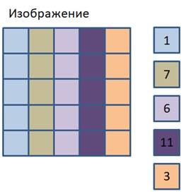
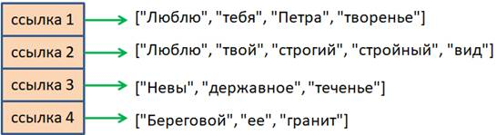

# 3.9. Вложенные списки, многомерные списки

Это заключительное занятие по спискам языка Python. Сегодня мы с вами узнаем, как формировать вложенные списки и работать с ними. Но сначала, что это такое и зачем они нужны.



Давайте представим, что нам в программе нужно хранить изображение. Для примера я нарисовал его небольшим, всего 5 на 5 пикселей. Каждый цвет представляется своим уникальным числом. Я, условно, обозначил их 1, 7, 6, 11 и 3. Значит, для представления этих данных нам нужен двумерный список 5x5 с соответствующими числовыми значениями. Мы уже знаем, как задавать одномерный список:

```python
>>> line = [1, 7, 6, 11, 3]
>>>
```

Но так он описывает всего лишь одну строку. А нам нужно хранить пять таких строк. Учитывая, что элементом списка может быть другой список, то данное изображение можно задать так:

```python
>>> img = [[1, 7, 6, 11, 3], [1, 7, 6, 11, 3], [1, 7, 6, 11, 3], [1, 7, 6, 11, 3], [1, 7, 6, 11, 3]]
>>>
```

Мы здесь внутри первого списка определили пять вложенных и в результате получили двумерный список. Кстати, его можно было бы сформировать и проще, учитывая, что все вложенные списки одинаковы, на основе списка line, следующим образом:

```python
>>> img = [line[:], line[:], line[:], line[:], line[:]]
>>>
```

В итоге получим такой же список с независимыми строками:

```python
>>> img
[[1, 7, 6, 11, 3], [1, 7, 6, 11, 3], [1, 7, 6, 11, 3], [1, 7, 6, 11, 3], [1, 7, 6, 11, 3]]
>>>
```

Вот эта последняя запись нам показывает структуру представления многомерных данных на уровне списков. Первый главный список хранит ссылки на вложенные списки. А вложенные списки уже хранят ссылки на соответствующие числа, представляющие тот или иной цвет. Поэтому, если взять первый элемент главного списка:

```python
>>> img[0]
[1, 7, 6, 11, 3]
>>>
```

то мы получим список, представляющий первую строку (или, первый столбец в зависимости от интерпретации программистом этих данных). Главное, что мы получаем доступ к первому вложенному списку. А раз это так, то можно записать еще одни квадратные скобки и из этого вложенного списка взять, допустим, второй элемент:

```python
>>> img[0][1]
7
>>>
```

При помощи такого синтаксиса мы можем обращаться к конкретному элементу многомерного вложенного списка.

Также, можно заменить, например, вторую строку на новую, допустим, такую:

```python
>>> img[1] = [0, 0, 0, 0, 0]
>>> img
[[1, 7, 6, 11, 3], [0, 0, 0, 0, 0], [1, 7, 6, 11, 3], [1, 7, 6, 11, 3], [1, 7, 6, 11, 3]]
>>>
```

или, то же самое, в более краткой форме:

```python
>>> img[1] = [0] * 5
>>> img
[[1, 7, 6, 11, 3], [0, 0, 0, 0, 0], [1, 7, 6, 11, 3], [1, 7, 6, 11, 3], [1, 7, 6, 11, 3]]
>>>
```

Что в итоге здесь произошло? Мы сформировали новый объект - список из нулей, связали с ним вторую ссылку главного списка, а прежний список был автоматически удален сборщиком мусора.

Если бы мы хотели изменить значения уже существующего вложенного списка, то следовало бы обратиться к его элементам, например, через механизм срезов:

```python
>>> img[:] = [1] * 5
>>> img
[[1, 7, 6, 11, 3], [1, 1, 1, 1, 1], [1, 7, 6, 11, 3], [1, 7, 6, 11, 3], [1, 7, 6, 11, 3]]
>>>
```

и присвоить его элементам новые числовые значения.

В чём разница в этих двух вариантах `img[1] = [0] * 5` и `img[:] = [1] * 5`?

В первом случае `img[1] = [0] * 5` мы формируем новый список `[0, 0, 0, 0, 0]` и второму элементу списка `img` присвоили значение этого списка.

Во втором случае `img[:] = [1] * 5` мы не создаём новый список, а в существующий список просто записываем новые значения.

Вот так это работает в деталях.

В качестве второго примера мы представим вложенными списками строки известного стихотворения на уровне отдельных слов:

> Люблю тебя, Петра творенье,\
> Люблю твой строгий, стройный вид,\
> Невы державное теченье,\
> Береговой ее гранит

Здесь в каждой строке разное число слов, но для вложенных списков - это не проблема. Они могут иметь разное число элементов:

```python
>>> t = [["Люблю", "тебя", "Петра", "творенье"],
     ["Люблю", "твой", "строгий", "стройный", "вид"],
     ["Невы", "державное", "теченье"],
     ["Береговой", "ее", "гранит"]
     ]
>>> t
[['Люблю', 'тебя', 'Петра', 'творенье'], ['Люблю', 'твой', 'строгий', 'стройный', 'вид'], ['Невы', 'державное', 'теченье'], ['Береговой', 'ее', 'гранит']]
>>>
```

Вы видите, что в отличии от предыдущего примера, здесь количество элементов вложенных списков разное:



Т.е. мы получаем не равномерное представление на уровне вложенных списков.

Соответственно, если мы обратимся к первому элементу, то получим первую строчку:

```python
>>> t[0]
['Люблю', 'тебя', 'Петра', 'творенье']
>>>
```

если возьмём эту первую строчку и из неё выделим третий элемент:

```python
>>> t[0][2]
'Петра'
>>>
```

то получим слово `'Петра'`.

Мало того мы его можем мы его можем заменить, допустим, так:

```python
>>> t[0][2] = "Питон"
>>> t[0]
['Люблю', 'тебя', 'Питон', 'творенье']
>>>
```

Также к этому списку мы можем добавить ещё одну строчку, используя известный метод `append()`:

```python
>>> t.append(["Твоих", "оград", "узор", "чугунный"])
>>> t
[['Люблю', 'тебя', 'Питон', 'творенье'], ['Люблю', 'твой', 'строгий', 'стройный', 'вид'], ['Невы', 'державное', 'теченье'], ['Береговой', 'ее', 'гранит'], ['Твоих', 'оград', 'узор', 'чугунный']]
>>>
```

Никто не запрещает нам удалить какой-нибудь элемент, например, вторую строку:

```python
>>> del t[1]
>>> t
[['Люблю', 'тебя', 'Питон', 'творенье'], ['Невы', 'державное', 'теченье'], ['Береговой', 'ее', 'гранит'], ['Твоих', 'оград', 'узор', 'чугунный']]
>>>
```

В заключение покажу пример многомерного списка с разными уровнями вложенности:

```python
>>> A = [[[True, False], [1, 2, 3]], ["матрица", "вектор"]]
>>> A
[[[True, False], [1, 2, 3]], ['матрица', 'вектор']]
>>>
```

Здесь у нас первым элементом у нас идёт двумерное представление, а вторым элементом - одномерное, т.е. обычный одномерный список.

Если мы обратимся к первому элементу списка `A`:

```python
>>> A[0]
[[True, False], [1, 2, 3]]
>>>
```

то мы увидим двухмерный список.

А при обращении ко второму элементу:

```python
>>> A[1]
['матрица', 'вектор']
>>>
```

мы увидим второй элемент - одномерный список.

Соответственно, для того, чтобы из двумерного списка `[[True, False], [1, 2, 3]]` взять какое-нибудь значение, нужно уже прописывать три индекса:

```python
>>> A[0][1][0]
1
>>>
```

Таким образом в Python можно определять многомерные списки разной структуры и разного уровня вложенности.
