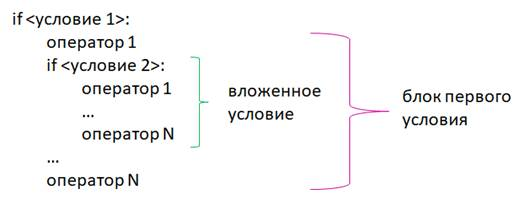
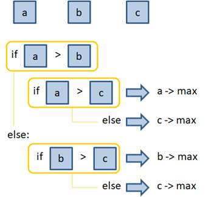

# 4.2. Вложенные условия и множественный выбор. Конструкция if-elif-else

## 4.2.1. Вложенные условия и множественный выбор

Продолжим изучение условных операторов языка программирования Python.

На предыдущем занятии мы познакомились с работой оператора if проверки условий. И говорили, что внутри блока этого оператора могут быть любые конструкции языка Python, в том числе и другие условия:



Давайте посмотрим на примерах как это работает, как работает вложенный условный оператор.

Предположим, что сначала в первом условии нам нужно проверить число на четность, а затем, определить, является ли это число цифрой или каким-либо другим числом (`04.01.01.py`):

```python
x = int(input())

if x % 2 == 0:
    if 0 <= x <= 9:
        print("x - цифра")
    else:
        print("x - число")
```

Программа получилась совсем не сложной. Запустим её в режиме отладки, поставив точку останова перед строкой `if x % 2 == 0`. Нажмём `F5` и посмотрим пошагово как она работает. При запросе введём, допустим, число `10` и нажмём `Enter`. Выполнение программы дошло до точки останова. Далее будем нажимать `F11` для последовательного перехода к последующим строкам. Число `10` является чётным, поэтому первое условие `if x % 2 == 0` сработало и следовательно мы попали в блок первого оператора `if`. Второе условие `if 0 <= x <= 9` не выполняется, поэтому мы пропускаем блок этого оператора `if` и попадаем в блок `else`, который относится ко второму оператору `if`, т.к. они записаны с одним и тем же отступом. И соответственно в консоли печатается:

```python
x - число
```

А теперь ещё раз запустим эту программу в том же режиме отладки, но введём другое значение `x`, например `6`.

Опять же первое условие `if x % 2 == 0` выполняется и мы переходим к вложенному оператору `if`. В данном случае `x` попадает в диапазон от `0` до `9`, поэтому срабатывает строка `print("x - цифра")`. Соответственно в консоли мы свами это и видим.

Ещё раз обратим внимание, что оператор `else` относится к вложенному оператору `if`, т.к. у них отступы находятся на одном уровне.

А если бы мы записали программу так, чтобы оператор `else` был на одном уровне с первым оператором `if`:

```python
x = int(input())

if x % 2 == 0:
    if 0 <= x <= 9:
        print("x - цифра")
else:
    print("x - число")
```

то он уже бы относился именно к нему и программа стала бы работать иначе и, вообще говоря, некорректно для данной задачи.

Т.е. обращайте внимание на отступы при написании программ на языке Python.

**Форматирование кода в Python имеет принципиальное значение.**

Но вернёмся к первому варианту нашей программы. Запишем её в файл `04.02.02.py` и добавим в неё ещё один оператор `else` для первого условия:

```python
x = int(input())
MAX_FOR_DIGIT = 9

if x % 2 == 0:
    if 0 <= x <= MAX_FOR_DIGIT:
        print("x - цифра")
    else:
        print("x - число")
else:
    print("x - не чётное число")
```

И запустим эту программу. В этот раз не будем запускать её в режиме отладки, вы уже и так прекрасно понимаете как здесь всё работает, но тем не менее посмотрим на результат её работы.

Введём число `11` и увидим результат:

```python
x - не чётное число
```

Т.е. условие в строке `if x % 2 == 0` не выполнилось, мы пропускаем весь блок этого условия и переходим к последнему оператору `else` и, соответственно, выполняется строка `print("x - не чётное число")`.

Если же мы введём какое-либо чётное число, например `12`, то, соответственно, мы перейдём в блок первого условия, здесь строка `if 0 <= x <= 9` вернёт нам `False` и мы увидим в консоли:

```python
x - число
```

вот так и работают вложенные операторы `if` и `else`.

Давайте рассмотрим ещё один пример поиска максимального из трёх чисел, которые определены через переменные `a`, `b` и `c`.

Как мы можем это сделать?

Например так:



В первом операторе `if` проверяем `a > b` и если это так, то нам осталось сравнить `a > c`. И если `a > c`, значит `a` является максимальным числом. А иначе мы делаем вывод, что максимальное число `c`.

Если же первое условие не срабатывает, то мы перейдём к его оператору `else` и там делаем проверку `b > c`. Если это условие возвратит `True`, значит `b` является максимальным числом, а иначе - `c`.

Таким образом при помощи вложенных операторов можно найти максимальное из трёх чисел.

Давайте реализуем это в программе `04.02.03.py`:

```python
a = int(input("a: "))
b = int(input("b: "))
c = int(input("c: "))

if a > b:
    if a > c:
        print("a -> max")
    else:
        print("c -> max")
else:
    if b > c:
        print("b -> max")
    else:
        print("c -> max")
```

Запустим эту программу, на запрос переменных введём значения: `a = 3`, `b = 2`, `c = 4`. После этого программа выведет:

```python
c -> max
```

Давайте в деталях рассмотрим как это работает. Поставим точку останова перед строкой `if a > b` и после запуска отладки введём значения `a = 3`, `b = 5`, `c = 2`.

При выполнении первой проверки `if a > b` программа вернёт `False`, блок первого условия пропускается и переходим к блоку `else` этого условия. В этом блоке вначале мы проверяем `b > c`, это действительно так, значит это условие сработает и в консоль выведется `b -> max`. На этом программа завершается.

Давайте теперь при выполнении этой программы введём другие значения: `a = 4`, `b = 3`, `c = 2`.

В этом случае первое условие у нас теперь сработает мы переходим к проверке `if a > c`, в данном случае - `True`, поэтому в консоль будет выведено `a -> max`.

Я думаю из этих примеров стало понятно как использовать вложенные условия. Причём степень вложенности может быть любой, но всё будет работать по аналогии. В практике реального программирования нормальным считается вложение до трёх. Если у вас выходит больше, то скорее всего что-то делается не так и структуру программы следует пересмотреть.

## 4.2.1. Конструкция if-elif-else

Во второй части этого занятия я хочу рассказать вам о способе реализации множественного выбора. Что это такое? Представьте, что мы просим пользователя выбрать один из пунктов меню:

1. Курс по Python
2. Курс по С++
3. Курс по Java
4. Курс по JavaScript

Т.е. пользователь с клавиатуры вводит номер выбранного пункта меню. Например, если пользователь введёт `2`, то выберет курс по С++, если выберет `3`, то выберет курс по Java и т.д.

Используя текущие знания, мы можем реализовать это так (файл `04.02.04.py`):

```python
item = int(input())

if item == 1:
    print("Выбран курс по Python")
else:
    if item == 2:
        print("Выбран курс по C++")
    else:
        if item == 3:
            print("Выбран курс по Java")
        else:
            if item == 4:
                print("Выбран курс по JavaScript")
            else:
                print("Неверный пункт")
```

Но эту же логику в Python можно реализовать проще и нагляднее используя ещё один условный оператор `elif`.

**`elif`** - это сокращение от **`else if`**.

Т.е. каждую конструкцию `else if` мы можем реализовать с помощью оператора `elif`.

И наша программа может быть записана в таком простом виде (файл `04.02.05.py`):

```python
item = int(input())

if item == 1:
    print("Выбран курс по Python")
elif item == 2:
    print("Выбран курс по C++")
elif item == 3:
    print("Выбран курс по Java")
elif item == 4:
    print("Выбран курс по JavaScript")
else:
    print("Неверный пункт")
```

В данном случае программа сначала проверяет значение переменной `item` на равенство `1`, если это так, то печатается сообщение `Выбран курс по Python`, а иначе мы продолжаем проверки.

Первый оператор `elif` сработает только в том случае, если переменная `item` равна `2` и если это так, то будет напечатано `Выбран курс по C++` и т.д. Т.е. у нас везде происходят взаимоисключающие ситуации.

Ну, а в конце, если ни одна из проверок до этого не сработает то оператор `else` выполнит вывод сообщения `Неверный пункт`.

Видите, как удобен оператор `elif` когда необходимо выбрать одно значение из множества доступных.

Причём последовательность операторов `if-elif-else` должна быть именно такой. Т.е. мы можем использовать только один оператор `if` или связку `if-else`, или `if-elif`, или `if-elif-else`, любую комбинацию, но последовательность должна быть именно такой - `if-elif-else`.

Рассмотрим ещё один пример, когда используется не только проверка на равенство, но и более сложная конструкция. Например, вводим с клавиатуры целое положительное x и если оно положительно определяем его него разрядность (файл `04.02.06.py`):

```python
x = int(input())

if x < 0:
    print("x должно быть положительным")
elif 0 <= x <= 9:
    print("x - цифра")
elif 10 <= x <= 99:
    print("x - двузначное число")
elif 100 <= x <= 999:
    print("x - трёхзначное число")
```

Запустим программу и введём, допустим, отрицательное значение `-10` и получим:

```python
x должно быть положительным
```

т.е. сработало первое условие - оператор `if` и в консоли было выведено соответствующее сообщение. Все остальные проверки были проигнорированы.

Снова запустим программу и введём, например, положительное значение `7` и увидим:

```python
x - цифра
```

И действительно условие по оператору `if` не сработало, мы перешли к следующему условию `elif`, оно оказалось истинным и мы увидели сообщение `x - цифра`. Соответственно, последующие проверки уже не проводились.

Если же мы введём число, к примеру, `765`, то получим:

```python
x - трёхзначное число
```

Таким образом можно реализовывать множественные проверки на языке Python.

В целом по сегодняшнему занятию всё, а на следующем занятии мы ещё затронем тему тернарных условий.
