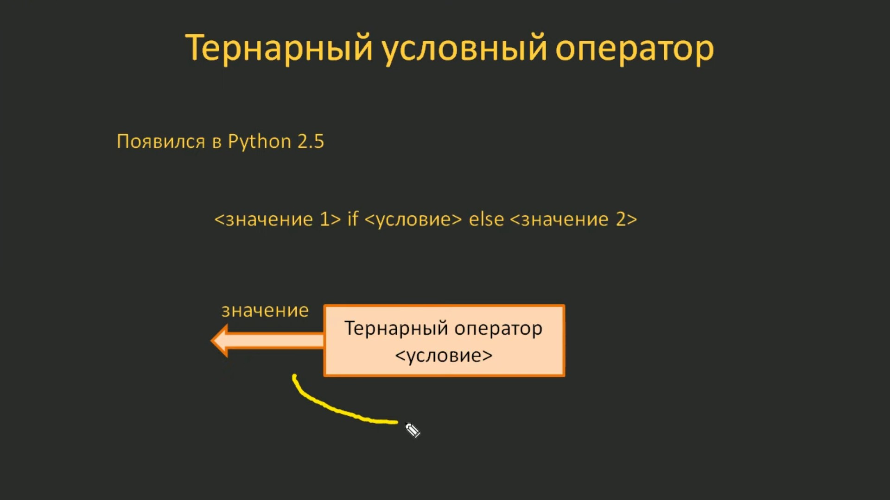

# 4.3. Тернарный условный оператор. Вложенное тернарное условие

## 4.3.1. Тернарный условный оператор

На этом занятии по курсу языка Python мы поговорим о тернарном условном операторе, который появился в Python версии 2.5. Как всегда, вначале поясню, что это за оператор.

В простейшем варианте его синтаксис можно представить так:

```python
<значение 1> if <условие> else <значение 2>
```

т.е он возвращает значение 1, если условие истинно, а иначе - значение 2.

Давайте поясню его работу на конкретном примере. Предположим, у нас имеются две переменные. И мы хотим для них определить максимальное значение. Используя имеющиеся знания, это можно было бы сделать так:

```python
a = 12
b = 7

if a > b:
    res = a
else:
    res = b

print(res)
```

Запустив эту программу, мы получим:

```python
12
```

А с использованием тернарного оператора это можно реализовать так:

```python
a = 12
b = 7

res = a if a > b else b

print(res)
```

Результатом работы этой программы также будет:

```python
12
```

Т.е. в данном случае тернарный оператор возвращает `a`, если а будет больше `b`, а иначе возвращается `b`. Вот так он и работает.

Но всё же между рассмотренными нами вариантами есть одно принципиальное отличие. Тернарный оператор автоматически возвращает результат. В данном примере это или переменная `a` или переменная `b`. Тогда как обычный условный оператор выполняет блок кода по определённому условию и сам по себе не возвращает ни каких значений.

Т.е. если бы мы попытались присвоить какой либо переменной результат работы обычного условного оператора, то у на бы ничего не получилось:

```python
a = 12
b = 7

d = if a > b:
    res = a
else:
    res = b

print(res)
```

У нас бы возникла синтаксическая ошибка. Так делать нельзя.

А вот результат работы тернарного оператора мы обычно сохраняем в некой переменной.

Второе важное отличие: в тернарном операторе нет внутренних блоков. Поэтому вместо, как в нашем случае, `a` и `b` можно прописывать только по одной какой-либо конструкции языка Python. Часто это некое значение или результат работы операторов, например, арифметических. Т.е. мы могли бы сделать так:

```python
a = 12
b = 7

res = a + 2 if a > b else b - 5

print(res)
```

Такая запись тоже будет верной.

Если мы запустим этот код, то получим:

```python
10
```

т.е. `12 - 2` будет равно `10`.

Или же мы можем использовать какие-либо функции:

```python
a = -12
b = -7

res = abs(a) if a > b else abs(b)

print(res)
```

И запустив эту программу, получим:

```python
7
```

Т.е. у нас выполнился фрагмент `else`, т.к. `-7` больше и вычислен модуль этого числа. Так, в принципе, можно прописать любую функцию.

Рассмотрим ещё один пример. Пусть имеется некая строка `s` со значением `python` и переменная `t`, которая тоже будет являться строкой со значением `upper`. И будем считать, что если переменная `t` ссылается на строку `upper`, то строку `s` следует перевести в верхний регистр, а в противном случае - оставить её так как она и есть. Это можно легко сделать с помощью тернарного оператора:

```python
s = 'python'
t = 'upper'

res = s.upper() if t == 'upper' else s
print(res)
```

Посмотрим, что у нас получится:

```python
'PYTHON'
```

Мы получили `PYTHON` заглавными буквами. Т.е. у нас был выполнен метод `s.upper()`, потому что условие `if t == 'upper'` вернуло `True` и соответственно функция `print(res)` вывела в консоль строку `'PYTHON'` заглавными буквами.

Если же мы переменной `t` присвоим другое значение, например, `lower`, то строка `s` останется в том состоянии, в котором она была изначально и print(res) выведет - `python`. Т.е. тернарный оператор не выполнился и переменной `res` будет присвоено значение переменной `s` без каких-либо изменений, что мы и увидим в консоли.

Вы видите как элементарно и просто реализуется эта идея. В этом большой плюс тернарного оператора.

Вообще тернарный оператор можно рассматривать как некий активный объект, который возвращает определенное значение в зависимости от условия:



Рассмотрим пример. Для этого запустим в терминале Python Console:

```python
$ python
Python 3.11.4 (main, Jun 21 2023, 20:33:35) [GCC 13.1.1 20230429] on linux
Type "help", "copyright", "credits" or "license" for more information.
>>>
```

Определим две переменные `a` и `b` и далее опишем элементы списка, следующим образом:

```python
>>> a = 12
>>> b = 7
>>> [1, 2, a if a < b else b, 4, 5]
[1, 2, 7, 4, 5]
>>>
```

Здесь, у нас, никаких ошибок не будет, выполнится тернарный условный оператор и вернёт значение переменной `b`, поэтому мы и видим третьим элементом списка значение `7`. Т.е. и так тоже можно делать.

Можно так делать и со строками:

```python
>>> "a - " + ("чётное" if a % 2 == 0 else "нечётное") + " число"
'a - чётное число'
>>>
```

У нас получилась строка `'a - чётное число'`. Т.е. мы слово либо `чётное`, либо `нечётное` формируем с помощью тернарного оператора. Причём, обратите внимание на круглые скобки, в которые заключён тернарный оператор, они здесь необходимы. Как раз, эти круглые скобки определяют где начинается и где заканчивается тернарный оператор.

Ещё один пример. Этот тернарный оператор можно использовать и в аргументах функции.

Например, вот так:

```python
>>> max(1, 2, a if a > 0 else b, 4, 5)
12
>>>
```

И получим значение `12`, т.к. тернарный оператор вернул значение переменной `a` - `12`, которое является наибольшим в списке.

Думаю, из приведённых примеров понятен принцип использования тернарного условного оператора.

## 4.3.2. Вложенный тернарный оператор

Так как внутри тернарного оператора можно использовать любые конструкции, то никто нам не мешает вложить один тернарный оператор в другой, например, так:

```python
<r_1> if <c_1> else <r_2> if <c_2> else <r_3>
```

или даже так:

```python
<r_1> if <c_1> else <r_2> if <c_2> else <r_3> if <c_3> else <r_4>
```

Сразу скажу, что это делается крайне редко и лучше избегать таких вложений, так как восприятие и понимание текста программы резко снижается.

Поэтому рассмотрим лишь один пример с такими вложениями. На предыдущем занятии мы с вами записывали вложенные условия для определения максимального из трех чисел. Давайте сделаем то же самое, но через тернарные операторы. Программа у нас была такой (файл `04.02.03.py`):

```python
a = int(input("a: "))
b = int(input("b: "))
c = int(input("c: "))

if a > b:
    if a > c:
        print("a -> max")
    else:
        print("c -> max")
else:
    if b > c:
        print("b -> max")
    else:
        print("c -> max")
```

Давайте сделаем тоже самое с помощью тернарного условного оператора в файле `04.03.01.py`:

```python
a = 2
b = 3
c = -4

d = (a if a > c else c) if a > b else (b if b > c else c)
print(d)
```

Запустим программу и увидим в консоли результат:

```python
3
```

Действительно максимальным числом из заданных в программе будет `3`.

Вот так можно реализовать вложенный тернарный оператор. Но опять же, это делается крайне редко на практике. В основном используется простая конструкция `if-else` без всяких вложений. Городить огороды с вложенными тернарными операторами - это не лучшая практика. Такого лучше избегать.
