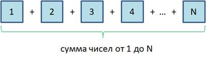
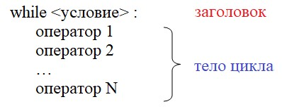
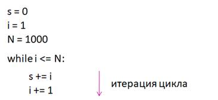

# 5.1. Оператор цикла `while`

На этом занятии начнем знакомиться с еще одним ключевым элементом компьютерных программ - циклами. Вначале, давайте я на простом примере покажу, о чем идет речь.

Представим, что нам нужно вычислить сумму целых чисел от 1 до N. Причем, N может быть сколько угодно большой: тысяча, миллион и так далее. Понятно, что мы не можем здесь просто записать операторы сложения чисел друг за другом для вычисления этой последовательности. Тем более, что на момент написания программы, N может быть неизвестна. Вот в таких ситуациях нам на помощь, как раз, и приходят циклы.



Циклы позволяют реализовывать некие повторяющиеся действия. Например, предположим, что маленькие панды прыгают с горки в течение часа, пока мама-панда не позовет всех к столу - кушать. На уровне текста это можно записать, так:

```markdown
цикл (пока не прошел час):
    прыгаем с горки
```

То есть, пока истинно условие, цикл работает, как только условие становится ложным - прошел час, цикл завершается. Ровно так работает цикл while, о котором и пойдет речь на нашем занятии. Он имеет, следующий синтаксис:



Вначале записывается ключевое слово **`while`**, затем, **условие** работы цикла, ставится двоеточие для определения **блока операторов**, которые будут выполняться внутри этого цикла. Такой блок еще называют **телом цикла**, а ключевое слово `while` с условием - **заголовком цикла**.

Обратите внимание на форматирование. Здесь также, как и в условных операторах, набор операторов внутри тела цикла должны иметь одинаковые отступы относительно ключевого слова `while`.

Но, давайте вернемся к исходной задаче - вычисления суммы чисел от `1` до `N` и посмотрим, как здесь нам поможет цикл `while`. Вначале, в файле `05.01.01.py`, определим три вспомогательные переменные: `N` - значение последнего слагаемого; `s` - для хранения вычисленной суммы (начальное значение `0`); `i` - значение текущего слагаемого (начинается с `1` и доходит до числа равного значению `N`), затем запишем цикл в котором и производятся необходимые нам расчёты:

```python
# sourcery skip: simplify-generator, sum-comprehension, while-to-for
N = 1000
s = 0
i = 1

while i <= N:
    s += i
    i += 1

print(s)
```

Теперь запустим эту программу и посмотрим, что получится:

```python
500500
```

Смотрите, как будет работать эта программа.

Так как сумму нужно вычислять, пока слагаемое `i` не достигнет значения `N`, то условие цикла можно определить, следующим образом:

```python
while i <= N:
```

А внутри цикла будем выполнять следующие действия:

```python
    s += i
    i += 1
```

Вначале `i` равна 1 и эта единица прибавляется к сумме s. После чего `i` увеличивается на `1` и становится равной `2`. Затем, выполняется проверка условия цикла. Пока оно у нас истинно, поэтому снова попадаем внутрь тела цикла и к `s` прибавляется уже значение `2`, а `i` опять увеличиваем на `1` и оно становится равным `3`. И так до тех пор пока `i` не станет больше либо равно `N`. К этому моменты мы просуммируем все числа и результат будет храниться в переменной `s`. Вот принцип работы циклов, причем, во всех языках программирования, не только в Python.



Также однократное выполнение тела цикла в программировании называют итерацией. Я буду часто использовать этот термин, поэтому привел его, чтобы вы меня правильно понимали.

Возможно у вас  возник вопрос, какие условия можно прописывать внутри цикла `while`? на самом деле, те же самые, что в условных операторах, в том числе и составные.

Например, давайте будем вычислять сумму пока не дойдем до слагаемого `N` или до значения `50`. Так как цикл работает, пока истинно условие, то его следует записать, так (файл `05.01.02.py`):

```python
N = 1000
s = 0
i = 1

while i <= N and i <= 50:
    s += i
    i += 1

print(s)
```

Выполним эту программу и получим уже совсем другой результат:

```python
1275
```

Это сумма первых 50-ти слагаемых. Т.е. наш цикл работал пока истинно условие `i <= N and i <= 50`. А это условие будет истинно, пока будет истинно и подусловие `i <= N`, и подусловие `i <= 50`, если хотя бы одно из этих подусловий окажется ложным, то ложным станет и всё общее условие. И в этом случае цикл `while` завершает свою работу. Т.е. он завершит свою работу либо когда `i` достигнет значения `N`, либо когда `i` достигнет `50`.

Это надо хорошо себе представлять. В циклах прописываются условия их работы, а не завершения.
