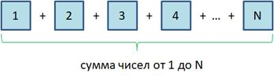
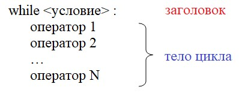
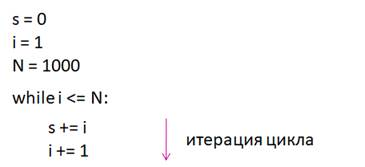

# 5.1. Оператор цикла `while`

На этом занятии начнем знакомиться с еще одним ключевым элементом компьютерных программ - циклами. Вначале, давайте я на простом примере покажу, о чем идет речь.

Представим, что нам нужно вычислить сумму целых чисел от 1 до N. Причем, N может быть сколько угодно большой: тысяча, миллион и так далее. Понятно, что мы не можем здесь просто записать операторы сложения чисел друг за другом для вычисления этой последовательности. Тем более, что на момент написания программы, N может быть неизвестна. Вот в таких ситуациях нам на помощь, как раз, и приходят циклы.



Циклы позволяют реализовывать некие повторяющиеся действия. Например, предположим, что маленькие панды прыгают с горки в течение часа, пока мама-панда не позовет всех к столу - кушать. На уровне текста это можно записать, так:

```markdown
цикл (пока не прошел час):
    прыгаем с горки
```

То есть, пока истинно условие, цикл работает, как только условие становится ложным - прошел час, цикл завершается. Ровно так работает цикл while, о котором и пойдет речь на нашем занятии. Он имеет, следующий синтаксис:



Вначале записывается ключевое слово **`while`**, затем, **условие** работы цикла, ставится двоеточие для определения **блока операторов**, которые будут выполняться внутри этого цикла. Такой блок еще называют **телом цикла**, а ключевое слово `while` с условием - **заголовком цикла**.

Обратите внимание на форматирование. Здесь также, как и в условных операторах, набор операторов внутри тела цикла должны иметь одинаковые отступы относительно ключевого слова `while`.

Но, давайте вернемся к исходной задаче - вычисления суммы чисел от `1` до `N` и посмотрим, как здесь нам поможет цикл `while`. Вначале, в файле `05.01.01.py`, определим три вспомогательные переменные: `N` - значение последнего слагаемого; `s` - для хранения вычисленной суммы (начальное значение `0`); `i` - значение текущего слагаемого (начинается с `1` и доходит до числа равного значению `N`), затем запишем цикл в котором и производятся необходимые нам расчёты:

```python
N = 1000
s = 0
i = 1

while i <= N:
    s += i
    i += 1

print(s)
```

Теперь запустим эту программу и посмотрим, что получится:

```python
500500
```

Смотрите, как будет работать эта программа.

Так как сумму нужно вычислять, пока слагаемое `i` не достигнет значения `N`, то условие цикла можно определить, следующим образом:

```python
while i <= N:
```

А внутри цикла будем выполнять следующие действия:

```python
    s += i
    i += 1
```

Вначале `i` равна 1 и эта единица прибавляется к сумме s. После чего `i` увеличивается на `1` и становится равной `2`. Затем, выполняется проверка условия цикла. Пока оно у нас истинно, поэтому снова попадаем внутрь тела цикла и к `s` прибавляется уже значение `2`, а `i` опять увеличиваем на `1` и оно становится равным `3`. И так до тех пор пока `i` не станет больше либо равно `N`. К этому моменты мы просуммируем все числа и результат будет храниться в переменной `s`. Вот принцип работы циклов, причем, во всех языках программирования, не только в Python.



Также однократное выполнение тела цикла в программировании называют итерацией. Я буду часто использовать этот термин, поэтому привел его, чтобы вы меня правильно понимали.

Возможно у вас  возник вопрос, какие условия можно прописывать внутри цикла `while`? на самом деле, те же самые, что в условных операторах, в том числе и составные.

Например, давайте будем вычислять сумму пока не дойдем до слагаемого `N` или до значения `50`. Так как цикл работает, пока истинно условие, то его следует записать, так (файл `05.01.02.py`):

```python
N = 1000
s = 0
i = 1

while i <= N and i <= 50:
    s += i
    i += 1

print(s)
```

Выполним эту программу и получим уже совсем другой результат:

```python
1275
```

Это сумма первых 50-ти слагаемых. Т.е. наш цикл работал пока истинно условие `i <= N and i <= 50`. А это условие будет истинно, пока будет истинно и подусловие `i <= N`, и подусловие `i <= 50`, если хотя бы одно из этих подусловий окажется ложным, то ложным станет и всё общее условие. И в этом случае цикл `while` завершает свою работу. Т.е. он завершит свою работу либо когда `i` достигнет значения `N`, либо когда `i` достигнет `50`.

Это надо хорошо себе представлять. В циклах прописываются условия их работы, а не завершения.

Модифицируем наш код, так чтобы вычислялась сумма следующего ряда чисел: `1, 3, 5, 7, ...`. Т.е. эти значения идут уже через один.

Как можно посчитать сумму такого ряда чисел при помощи цикла while?

Очевидно это можно сделать следующим образом: на каждой итерации переменную `i` нужно увеличивать не на 1, а на 2. И тогда у нас получится, что первое слагаемое переменной `i` будет равно `1`, на следующей итерации мы увеличиваем `i` на 2, получим `3`, ну и т.д.

В итоге наш код будет выглядеть так:

```python
N = 1000
s = 0
i = 1

while i <= N and i <= 50:
    s += i
    i += 2

print(s)
```

Выполним эту программу:

```python
625
```

Смотрите, условие выполнения цикла мы не изменили, цикл будет выполняться, пока значение переменной `i` не превысит `N` или `50`. Т.е. когда мы значение переменной `i` увеличиваем на 2, здесь уже нет гарантии, что она дойдёт, именно, точно до значения `N` или до значения `50`. Мы в цикле указываем условие, когда он работает, а когда значение `i` становится больше то завершается.

Внутри цикла `while` можно прописывать самые разные операторы. Например:

```python
i = 1

while i < 10:
    print(i)
```

Если мы в таком виде запустим программу, то у нас цикл будет идти бесконечно, потому что в теле цикла мы переменную `i` не увеличиваем и она никогда не достигнет `10`, условие будет всегда истинным и цикл будет продолжаться.

Поэтому, чтобы всё сработало так как мы хотим запишем так (файл `05.01.03.py`):

```python
i = 1

while i < 10:
    print(i)
    i += 1
```

Т.е. мы счётчик будем увеличивать каждую итерацию на 1.

Запустив эту программу мы получим следующие значения:

```python
1
2
3
4
5
6
7
8
9
```

Как видите условие `i < 10` будет работать до тех пор пока `i` не станет равно `10` или не превысит это значение. Т.е. до `9` у нас цикл работал, а когда `i` стало равно `10` цикл `while` завершил свою работу.

Причём обратите внимание, что операторы сравнения `<` и `>` работают несколько быстрее чем операторы `<=` и `>=`. Поэтому при организации циклов стараются использовать именно операторы `<` и `>`, либо `=` и `!=`. Хотя это не строгая рекомендация и операторы `<=` и `>=` тоже могут быть использованы. Но тем не менее, если можно обойтись операторами `<`, `>`, `=` и `!=`, то лучше их и использовать.

Давайте предположим что мы хотим вывести в консоль возрастающую последовательность, а убывающую. Например: `-1, -2, -3, ..., -N`.

Посмотрим как это можно сделать.

В начале присвоим значения:

```python
N = -10
i = -1
```

Затем организуем цикл таким образом:

```python
while i >= N:
    print(i)
    i -= 1
```

В итоге мы получили такую программу (файл `05.01.04.py`):

```python
N = -10
i = -1

while i >= N:
    print(i)
    i -= 1

```

Запустим наш код:

```python
-1
-2
-3
-4
-5
-6
-7
-8
-9
-10

```

Вообще счётчик в цикле может может иметь необходимый вам вид, здесь нет никаких ограничений. Например (файл `05.01.05.py`):

```python
N = -10
i = -1

while i >= N:
    print(i)
    i *= 2
```

Запустим код:

```python
-1
-2
-4
-8
```

В заключении этого занятия рассмотрим ещё пару примеров с оператором цикла `while`.

Предположим, что пользователь у нас вводит некий пароль.

`pass_true` - истинный пароль, который нужно ввести.
`ps` - переменная в которую пользователь будет вводить значение пароля.

А далее сделаем цикл проверки правильности ввода пароля пользователем, получим следующую программу файл `05.01.06.py`:

```python
pass_true = "password"
ps = ""

while ps != pass_true:
    ps = input("Введите пароль: ")

print("Вход в систему.")
```

Запустим нашу программу. Если мы введём какой-нибудь не правильный пароль, например `school`, то получим:

```python
Введите пароль: school
Введите пароль:
```

Так происходит, потому что строка которую мы ввели не равна значению пароля в переменной `pass_true`, условие цикла истинно и цикл продолжается - снова выдаётся запрос на ввод пароля.

Если же мы введём верный пароль `password`, то увидим:

```python
Введите пароль: Введите пароль: password
Вход в систему.
```

Действительно, при совпадении паролей условие стало `False` и соответственно цикл `while` завершил свою работу. И программа перешла на следующую строчку после цикла - `print("Вход в систему")`.

Ну, и рассмотрим последний пример. Мы при помощи оператора цикла `while` выведем все числа кратные трём в диапазоне от 1 до N:

```python
N = 20
i = 1

while i <= N:
    if i % 3 == 0:
        print(i)
    i += 1
```

Давайте посмотрим, что у нас получилось:

```python
3
6
9
12
15
18
```

Вы видите, что в консоль выведены все числа кратные трём от `1` до `N`

Т.е. внутри цикла `while` можно использовать самые различные операторы, в том числе и условные.

На этом мы завершим наше первое знакомство с оператором цикла `while`. На следующем занятии мы продолжим эту тему.
