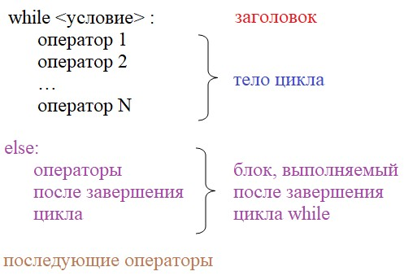

# 5.2. Операторы `break`, `continue` и `else`

## 5.2.1. Операторы `break` и `continue`

Мы продолжаем курс по языку Python. Это занятие начнем со знакомства операторов break и continue цикла while. Суть этих операторов, в следующем:

- `break` - досрочное завершение цикла;
- `continue` - пропуск одной итерации цикла.

### 5.2.1.1. Оператор `break`

Рассмотрим сначала оператор `break`.

**`break`** - досрочное завершение цикла `for` или цикла `while`.

Напишем следующую программу (файл `05.02.01.py`):

```python
print("Запуск цикла")

i = 0
while True:
    i += 1
    print(i)

print("Завершение цикла")
```

Если в качестве условия цикла записать значение `True`, то такой цикл будет работать "вечно", он сам никогда не остановится и строчку "Завершение цикла" мы не увидим. Программу в этом случае можно только прервать и полностью остановить.

Однако, если записать в тело цикла оператор `break`, то он прервется, как только встретится (файл `05.02.02.py`):

```python
print("Запуск цикла")

i = 0
while True:
    i += 1
    print(i)
    break

print("Завершение цикла")
```

Но вы скажете, конечно, зачем писать программы с «вечными» циклами, нужно корректно прописывать условие и все будет хорошо? Часто, именно так и следует поступать. Но бывают ситуации, когда все же требуется досрочно прерывать работу цикла. Например, у нас имеется список с числами и мы хотим определить, есть ли среди них хотя бы одно четное значение. Здесь удобно воспользоваться оператором `break`. Как только встретим первое четное значение, дальнейшую проверку можно не проводить (файл `05.02.03.py`):

```python
d = [1, 5, 3, 6, 0, -4]
fl_find = False
i = 0
 
while i < len(d):
    print(i)
    fl_find = d[i] % 2 == 0
    if fl_find:
        break
 
    i += 1
 
print(fl_find)
```

Конечно, эту же программу можно было бы построить и без break, используя составное условие (файл `05.02.04.py`):

```python
d = [1, 5, 3, 6, 0, -4]
fl_find = False
i = 0
while i < len(d) and d[i] % 2 != 0:
    i += 1

fl_find = i != len(d)

print(fl_find)
```

Но, на мой взгляд, первый вариант с `break` красивее и понятнее, чем второй. Хотя, все дело вкуса - кому, как нравится.

Я, думаю, что принцип работы оператора `break` понятен. Он прерывает работу любого оператора цикла, как только выполнение программы перейдет к нему.

### 5.2.1.2. Оператор `continue`

Рассмотрим следующий оператор `continue`.

**`continue`** - используется для завершения текущей итерации в цикле `for` (или цикле `while`) и перехода к следующей итерации.

Посмотрим на конкретном примере где и как его целесообразно применять.

Предположим, что мы просим пользователя вводить с клавиатуры числа и все нечетные значения суммируем. Как только пользователь введет 0, подсчет суммы прекращается. Реализовать эту программу удобно, следующим образом (файл `05.02.05.py`):

```python
sum_odd = 0
value = 1

while value != 0:
    value = int(input("Введите целое число: "))
    if value % 2 == 0:
        continue

    sum_odd += value
    print(f"Сумма нечетных чисел равна: {sum_odd}")
```

Смотрите, мы здесь на каждой итерации цикла проверяем, если текущее значение `value` чётное, то последующий подсчет суммы и вывод ее в консоль не выполняется, пропускается. При этом, цикл продолжает свою работу и переходит к следующей итерации, пока пользователь не введет число `0`. Благодаря оператору `continue` мы основную логику программы прописываем непосредственно в теле цикла, а не во вложенном блоке условного оператора. То есть, если программу переписать без `continue`, то она бы выглядела так (файл `05.02.06.py`):

```python
sum_odd = 0
value = 1
while value != 0:
    value = int(input("Введите целое число: "))
    if value % 2 != 0:
        sum_odd += value
        print(f"Сумма нечетных чисел равна: {sum_odd}")
```

Здесь получается массивный вложенный блок операторов. Конечно, на производительность это никак не влияет, но, все же такие вложения лучше избегать, так программа становится менее читабельной и удобной для дальнейшего редактирования. Так если мы вернёмся к нашей программе в файле `05.02.05.py`, то увидим, что основная логика программы записана не в отдельном блоке `if`, а, непосредственно, в цикле `while` и благодаря этому текст программы выглядит более читабельным, т.е. его удобнее понимать и удобнее редактировать.

## 5.2.2. Оператор `else`

В заключение этого занятия рассмотрим третий оператор циклов `else`. Да, мы уже говорили об этом операторе, когда рассматривали условия. У циклов он тоже есть и сейчас разберем, как работает.

Синтаксис этого оператора, следующий:



Разберём как он работает.

После тела цикла прописывается необязательный оператор `else`, в котором указываются операторы, исполняющиеся после штатного завершения цикла `while`.

И здесь возникает вопрос, чем блок операторов в теле оператора `else` отличается от операторов которые просто записаны после цикла `while`? Ведь эти операторы в любом случае будут выполняться после завершения работы оператора `while`, зачем что-то прописывать в теле оператора `else`?

Дело в том, что операторы в теле оператора `else` будут выполняться только в случае штатного завершения цикла `while`, т.е. когда условие цикла `while` примет значение `False`. Только в таком случае мы перейдём в блок `else`.

Рассмотрим это на конкретном примере. Предположим, что мы вычисляем сумму вида:

```markdown
S = 1/2 + 1/3 + 1/4 + 1/10 + … + 1/0
```

Если у нас встречается в ряде деление на `0`, то вычисления следует прервать.

Реализуем эту программу следующим образом (файл `05.02.07.py`):

```python
S = 0
N = 100
i = -10

while i < N:
    if i == 0:
        break
    S += 1 / i
    i += 1
else:
    print("Сумма вычислена корректно.")

print(S)
```

Запустим эту программу и посмотрим как она в данном случае отработает:

```python
-2.9289682539682538
```

Мы видим значение `-2.9289682539682538`, но при этом не видим сообщения `Сумма вычислена корректно.`, т.е. функция `print("Сумма вычислена корректно.")` не была выполнена - блок `else` был пропущен. Узнаем почему так произошло.

 В данном случае при вычислении суммы встречается деление на `0`, поэтому срабатывает оператор break и цикл досрочно прерывается, т.е., завершается в нештатном режиме. В этом случае блок `else` пропускается и мы не видим сообщения, что сумма вычислена корректно. Если же всё проходит штатно и цикл завершается по своему условию, то в консоли появляется сообщение `Сумма вычислена корректно.`, означающее выполнение блока `else`.

 Если же мы изменим значение `N`, например так (файл `05.02.08.py`):

 """5.2. Операторы break, continue и else.

Пример использования оператора else
"""

```python
S = 0
N = 0
i = -10

while i < N:
    if i == 0:
        break
    S += 1 / i
    i += 1
else:
    print("Сумма вычислена корректно.")

print(S)
```

То запустив программу, получим результат:

```python
Сумма вычислена корректно.
-2.9289682539682538
```

Это произошло, потому что у нас значение переменной `i` не было равно `0`? оператор `break` не сработал и цикл завершился штатно. Значит блок оператора `else` отработал и соответственно отработала и инструкция `print("Сумма вычислена корректно.")`.

Надеюсь, из этого примера вам стало понятно назначение оператора `else` цикла `while`.

Также после этого занятия вы должны себе хорошо представлять работу операторов `break` и `continue`.
