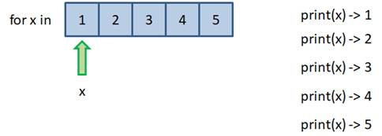
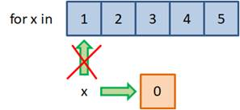
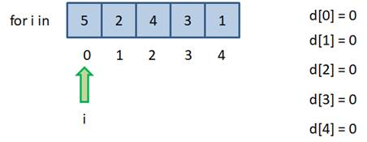

# 5.3. Оператор цикла `for` и функция `range`

## 5.3.1. Оператор цикла `for`

Оператор цикла `for`

На предыдущих занятиях мы с вами познакомились с оператором цикла `while`, а также вспомогательными операторами `break`, `continue` и `else`. На этом занятии вы узнаете о втором операторе цикла `for`, который довольно часто используется в Python.

Он имеет следующий синтаксис:

```python
for <переменная> in <итерируемый объект>:
      оператор 1
      оператор 2
       …
      оператор N
```

С его помощью очень легко реализовывать перебор, так называемых, итерированных объектов. Что это такое, мы будем говорить на одном из следующих занятий, а сейчас, вам достаточно знать, что это объекты, состоящие из множества элементов, которые можно перебирать. Например, списки или строки.

Как всегда, постичь магию работу этого оператора лучше всего на конкретных примерах.

Пусть у нас имеется список и мы хотим перебрать все его элементы. Через оператор цикла for сделать это можно, следующим образом (файл `05.03.01.py`):

```python
d = [1, 2, 3, 4, 5]

for x in d:
    print(x)
```

Как видите с оператором `for` делается это очень легко. Для этого сначала записываем оператор `for`, затем ставим некую переменную, в нашем случае `x`, далее оператор `in`, и после него список, который мы будем перебирать `d`. Далее двоеточие для формирования тела цикла. Ну, а теле цикла нам надо написать операторы, которые будут выполняться в цикле - у нас `print(x)`.

Запустим эту программу и посмотрим, что у нас получится:

```python
1
2
3
4
5
```

В консоли выводятся значения от `1` до `5`, т.е. значения, которые у нас хранятся в списке `d`.

Тоже самое можно сделать со строкой (файл `05.03.02.py`):

```python
for x in "python":
    print(x)
```

Запустив эту программу получим:

```python
p
y
t
h
o
n
```

Т.е. перебор строки будет происходить посимвольно.

Но давайте посмотрим, как все это работает в деталях.

Вернемся к примеру со списком `[1, 2, 3, 4, 5]`. На первой итерации переменная `x` будет ссылаться на первый элемент со значением `1`. Соответственно, функция `print()` выводит это значение в консоль. На следующей итерации переменная `x` ссылается уже на второй элемент и `print()` выводит значение `2`. И так до тех пор, пока не будет достигнут конец списка.



В этой демонстрации ключевое, что переменная `x` именно ссылается на элемент списка. То есть, если мы захотим изменить значение в списке, используя переменную x, например, вот так (файл `05.03.03.py`):

```python
d = [1, 2, 3, 4, 5]

for x in d:
    x = 0

print(d)
```

результатом выполнения программы будет:

```python
[0, 0, 0, 0, 0]
```



Ничего не получится. Здесь x просто будет ссылаться на другой объект со значением `0` и связь с элементы списка пропадёт, но элементы списка это никак не затронет. Т.е., в такой реализации оператора цикла `for` мы можем лишь перебирать значения элементов и что-то с ними делать, например, вычислять их сумму или произведение. Для вычислим произведение элементов списка (файл `05.03.04.py`):

```python
d = [5, 4, 3, 2, 1]
p = 1

for x in d:
    p*= x

print(p)
```

Выполним программу:

```python
120
```

Так делать можноЮ но менять значения элементов списка нельзя.

Но тогда возникает вопрос, как всё-таки это сделать если это необходимо?

Для этого к элементам списка нужно обратиться по индексу. Т.е. цикл должен перебирать не элементы списка, а его индексы (файл `05.03.05.py`):

```python
d = [5, 2, 4, 3, 1]
 
for i in [0, 1, 2, 3, 4]:
    d[i] = 0
 
print(d)
```

Результатом выполнения программы будет:

```python
[0, 0, 0, 0, 0]
```

Как видите, список изменился.



В этом случае, мы на каждой итерации цикла, обращаемся сначала к первому элементу списка по его индексу, присваиваем ему ноль, затем, ко второму элементу, присваиваем ему ноль и так для всех остальных элементов. В итоге все элементы списка меняют свои значения на ноль, меняется сам список.

Однако описывать индексы через еще один список, далеко не лучшая практика. Для подобных целей в Python существует специальная функция `range()`

## 5.3.2. Функция `range()`

Функция `range()`, которая генерирует арифметическую последовательность чисел с параметрами:

```python
range(start, stop, step)
range(start, stop)
range(stop)
```

Например, для генерации последовательности от `0` до `5`, функцию `range()` можно записывать в таких вариантах:

```python
range(5)
range(0, 5)
range(0, 5, 1)
```

т.е. мы будем генерировать последовательность чисел от `0` до `5`, причём, нужно помнить, что цифра `5` не входит в последовательность и на выходе мы получим такую последовательность:

```python
[0, 1, 2, 3, 4]
```

Рассмотрим всё это непосредственно в консоли Python.

```python
>>> range(5)
range(0, 5)
```

На выходе мы просто получим объект `range`.

Ну, а чтобы увидеть какие значения у нас всё же получаются, мы их преобразуем в список:

```python
>>> list(range(5))
[0, 1, 2, 3, 4]
```

И теперь мы видим значения, какие генерирует функция `range()`.

Или можем сделать так:

```python
>>> list(range(2))
[0, 1]
```

Если же написать:

```python
>>> list(range(0))
[]
```

то получим пустой список, т.е. не будет сгенерировано ни одного значения, т.к. `0` не включается в список и получаем от нуля до нуля не включая ноль.

Если мы аргументом функции `range()` укажем отрицательное число, например `-5`:

```python
>>> list(range(-5))
[]
```

то тоже получим пустой список, потому, что стартовое значение по умолчанию ноль и мы идём от `0`, до `-5` с шагом `1`, понятно, что до `-5 мы так никогда не дойдём.

А вот если начально значение указать, например `-10`:

```python
>>> list(range(-10, -5))
[-10, -9, -8, -7, -6]
```

то получим список в указанном диапазоне.

Или можем для предыдущего примера указать шаг `2`:

```python
>>> list(range(-10, -5, 2))
[-10, -8, -6]
```

Если же здесь указать отрицательный шаг:

```python
>>> list(range(-10, -5, -2))
[]
```

то снова получим пустой список. Ведь теперь мы начинаем двигаться от `-10` до `-5` с шагом `-2`, т.е. в сторону уменьшения и до `-5` так добраться не сможем.

Для отрицательных шагов последнее значение следует указать меньше стартового:

```python
>>> list(range(-10, -20, -2))
[-10, -12, -14, -16, -18]
```

Тоже самое можно сделать и в положительной области:

```python
>>> list(range(5, 0, -1))
[5, 4, 3, 2, 1]
```

Обратите внимание - `0` не включается.

Если нам нужно дойти до нуля, то нужно записать так:

```python
>>> list(range(5, -1, -1))
[5, 4, 3, 2, 1, 0]
```

Вот так мы можем генерировать последовательности в обратном порядке используя отрицательный шаг.

Теперь зная как работает функция `range()`, мы можем изменить программу записанную в файле `05.03.05.py` с помощью этой функции (файл `05.03.06.py`):

```python
d = [1, 2, 3, 4, 5]

for i in range(5):
    d[i] = 0

print(d)
```

т.е. мы будем перебирать индексы списка от `0` до `4` и если запустим программу, то увидим тот же самый результат:

```python
[0, 0, 0, 0, 0]
```

Т.е. мы перебрали все элементы списка и обнулили их значения. Причём, обратите внимание, что функцию `range()` не надо преобразовывать в список, оператор `for` умеет перебирать любые итерируемые объекты, а функция `range()` как раз возвращает итерируемые объекты.

Если же мы не знаем какой длины будет список, то в данном случае, как параметр функции `range()` лучше указать длину списка (файл `05.03.07.py`):

```python
d = [1, 2, 3, 4, 5]

for i in range(len(d)):
    d[i] = 0

print(d)
```

Результат будет тот же:

```python
[0, 0, 0, 0, 0]
```

но теперь наша программа сможет работать со списками разной длинны, например (файл `05.03.08.py`):

```python
d = [1, 2, 3, 4, 5, 6, -1]

for i in range(len(d)):
    d[i] = 0

print(d)
```

Результат выполнения программы:

```python
[0, 0, 0, 0, 0, 0, 0]
```

В заключении этого занятия рассмотрим ещё один пример использования цикла `for`. Для вычисления такой вот суммы:

```markdown
S = 1/2 + 1/3 + 1/4 + ... + 1/1000
```

Реализовать это можно следующим образом:

```python
S = 0

for i in range(2, 1001):
    S += 1 / i

print(S)
```

Запустим эту программу:

```python
6.485470860550342
```

Видим необходимый нам результат.

На этом завершим первое знакомство с операторами цикла `for` и функцией `range()`.

На данный момент вам нужно знать:

- как перебираются списки и строки;
- как формировать арифметические последовательности с помощью функции `range()`;
- как использовать функцию `range()` совместно с оператором цикла `for`.

Следующее занятие будет целиком посвящено примерам как использовать оператор цикла `for` со списками и строками.
