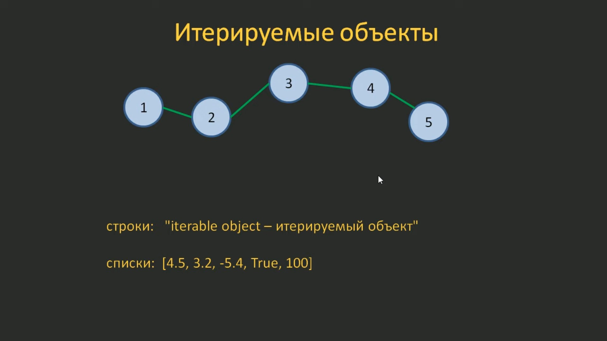
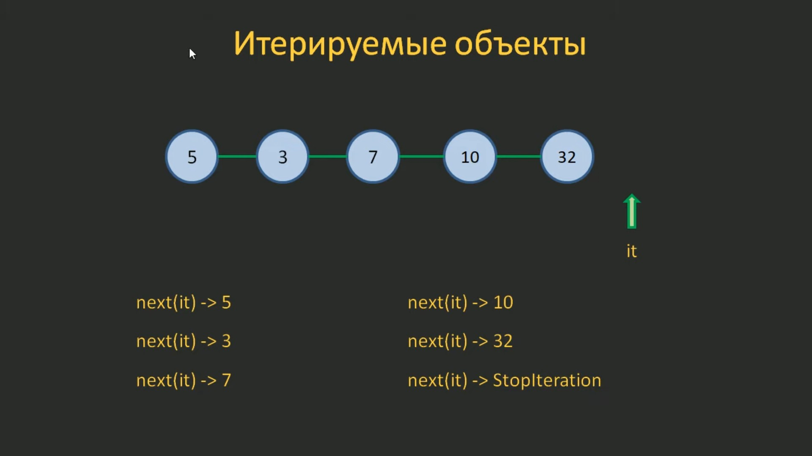
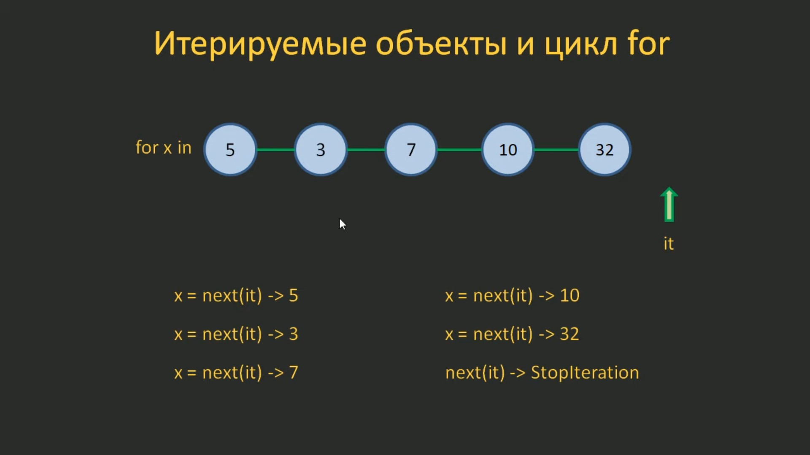

# 5.5. Итератор и итерируемые объекты. Функции `iter()` и `next()`

На этом занятии мы узнаем, что такое итерируемые объекты и познакомимся со способами их перебора. Мы уже знаем, что в Python существуют объекты, содержащие последовательность некоторых элементов. Например, строки и списки. Так вот, существует универсальный механизм для перебора элементов этих и других подобных им объектов. Реализуется он через специальную конструкцию под названием **итератор**. Т.е., каждый итерируемый объект предоставляет доступ к своим элементам через итератор. С помощью этого итератора можно один раз пройтись по всем элементам коллекции от начала до конца.



Посмотрим, как это реализуется непосредственно в программе. Для этого перейдём в Python-консоль.

Предположим, что у нас есть некоторый список, состоящий из целых чисел:

```python
>>> d = [5, 3, 7, 10, 32]
>>>
```

Если мы хотим вызвать итератор для этого списка, нам нужно вызвать специальную функцию `iter()`. Это встроенная функция языка Python.

**Функция `iter()`** - функция, которая возвращает объект-итератор.

Синтаксис:

```python
iter(object, sentinel)
```

Обязательный параметр:

`object` - объект, который мы хотим перебрать.

Необязательный параметр:

`sentinel` - значение, которое будет представлять конечный элемент итерируемого объекта.

Если мы в функцию `iter()` передадим итерируемый объект, в данном случае, список, то на выходе мы получим итератор, у нас - итератор списка:

```python
>>> iter(d)
<list_iterator object at 0x7fc20efdbca0>
>>>
```

Чтобы мы могли работать с этим итератором, сохраним его в некой переменной `it`:

```python
>>> it = iter(d)
>>>
```

Мы получили итератор для однократного перебора элементов списка.

Далее, чтобы перебрать значения итерируемого объекта используется встроенная функция `next()`.

**Функция `next()`** - функция, которая возвращает следующий элемент итерируемого объекта. Вы можете добавить возвращаемое значение по умолчанию, которое будет возвращаться в случае, если итерация достигла конца.

Синтаксис:

```python
next(iterable, default)
```

Обязательный параметр:

`iterable` - итерируемый объект.

Необязательный параметр:

`default` - значение по умолчанию, которое будет возвращаться, если итерация достигла конца.

В нашем случае, для перебора значений списка `d` мы должны использовать в качестве параметра функции `next()` итератор `it`:

```python
>>> next(it)
5
>>> next(it)
3
>>> next(it)
7
>>> next(it)
10
>>> next(it)
32
>>>
```

Если дойдя до конца списка, мы ещё раз вызываем функцию `next()`, то получим ошибку `StopIteration`:

```python
>>> next(it)
Traceback (most recent call last):
    File "<stdin>", line 1, in <module>
StopIteration
>>>
```

Визуально весь этот процесс можно представить следующим образом:



У нас есть список `d` и итератор `it`. Когда мы вызываем функцию `next()`, мы переходим на первый элемент итерируемого объекта и функция `next()` возвращает значение этого элемента - `5`. Далее, вызываем снова функцию `next()` и возвращается значение `3`. Вызывая `next()` следующий раз мы опять переходим к следующему элементу и получаем значение `7`. Вызываем её снова - получаем значение `10`. Ещё раз - значение `32`. И когда вызываем функцию `next()` после последнего элемента, она выдаёт ошибку `StopIteration`.

Т.е., таким образом происходит перебор элементов итерируемого объекта с помощью итератора. Причём когда он дошёл до конца, вернуть в начало его уже нельзя. Этот механизм позволяет один раз перебрать элементы итерируемого объекта по порядку от начала и до конца.

Если же мы хотим снова перебрать эти элементы с помощью итератора, его необходимо снова создать используя функцию `iter()`, т.е. получить новый итератор. И с помощью нового итератора опять перебрать эти элементы. Только так.

Так работает этот механизм, причём он универсален и не зависит от типа итерируемого объекта. Это может быть и строка и список и любой другой перебираемый объект.

Посмотрим как это будет работать со строками. Предположим, у нас есть строка `s = "python"` и мы хотим перебрать все её элементы с помощью итератора:

```python
>>> s = "python"
>>> it = iter(s)
>>> next(it)
'p'
>>> next(it)
'y'
>>> next(it)
't'
>>> next(it)
'h'
>>> next(it)
'o'
>>> next(it)
'n'
>>> next(it)
Traceback (most recent call last):
  File "<stdin>", line 1, in <module>
StopIteration
```

Как видите итератору всё равно что перебирать. Главное, чтобы сам объект поддерживал этот механизм, т.е. был итерируемым.

Также следует учитывать, что доступ к элементам через итератор и по индексу (например, `s[2]`) - это совершенно разные вещи. К тому же не у всех итерируемых объектов есть возможность указания индексов.

Помимо строк и списков к итерируемым объектам также относится функция `range()`. Например:

```python
>>> r = range(5)
>>> r
range(0, 5)
>>> it = iter(r)
>>> next(it)
0
>>> next(it)
1
>>> next(it)
2
>>> next(it)
3
>>> next(it)
4
>>> next(it)
Traceback (most recent call last):
  File "<stdin>", line 1, in <module>
StopIteration
```

Как видите, здесь тоже можно использовать перебор с помощью итератора.

Рассматривая перебор итерируемых объектов, не может не возникнуть вопрос: а зачем всё это надо?

Ведь мы можем без итераторов обращаться к элементам коллекций и получать определённые значения, например, `s[3]` или `d[2]`. Да всё верно. Если нам нужно извлечь какое-либо значение определённое, то именно так и следует делать. Но если нам в программе нужно постоянно перебирать итерируемые объекты самых разных типов, то единственный универсальный и безопасный способ это сделать - это использовать итераторы.

Например так происходит в операторе цикла `for`. Мы можем указать ему перебирать или список какой-нибудь (файл `05.05.01.py`):

```python
for x in [1, 2, 3, 4]:
    print(x)
```

Выполнив программу мы увидим это список:

```python
1
2
3
4
```

или другой итерируемый объект, например строку (файл `05.05.02.py`):

```python
for x in "python":
    print(x)
```

результат выполнения программы:

```python
p
y
t
h
o
n
```

или можем указать функцию `range()` (файл `05.05.03.py`):

```python
for x in range(5):
    print(x)
```

результат:

```python
0
1
2
3
4
```

Таким образом, цикл `for` умеет перебирать элементы совершенно разных итерируемых объектов как раз благодаря этому механизму итераторов.

Т.е., когда мы с помощью цикла `for` проходимся по элементам какой-либо коллекции, то в действительности используется механизм итераторов.



Сам оператор `for` вызывает функцию `next()` не явно и получает соответствующие значения, как только встречается ошибка `StopIteration` работа цикла `for` завершается.

Вот так в деталях на самом деле работает этот цикл.

Но в Python не все объекты являются итерируемыми. Например, обычное число `5` - это не перебираемый объект, это просто число. и если мы для него попробуем вызвать функцию `iter()`:

```python
>>> iter(5)
Traceback (most recent call last):
  File "<stdin>", line 1, in <module>
TypeError: 'int' object is not iterable
>>>
```

то получим ошибку. Ошибка в том, что объект типа `int` не является итерируемым, поэтому он не поддерживает механизм итераторов и, соответственно, его нельзя перебирать с помощью итератора. В общем, это очевидно, потому что `5` это обычное число.

А вот если мы `5` запишем как список:

```python
>>> iter([5])
<list_iterator object at 0x7fc20efdaf20>
>>>
```

тогда никаких проблем у нас не будет. В этом случае получим итератор для перебора такого простого списка `[5]`.

И так же это работает и в цикле `for`.

Если как итерируемый объект указать простое число (файл `05.05.04.py`):

```python
for x in 5:
    print(x)
```

и попробовать выполнить эту программу, то получим ошибку, что число не является итерируемым объектом:

```python
Traceback (most recent call last):
  File "/home/user/Projects/GitHub/Python/Learn_Python/learn-python-selfedu/listing/05-tsikly-iteratory-i-generatory spiskov/05.05.04.py", line 6, in <module>
    for x in 5:
TypeError: 'int' object is not iterable
```

Надеюсь из этого занятия вам стало понятно:

- что такое итератор и итерируемые объекты;
- как получить итератор с помощью функции `iter()`;
- как перебрать элементы итерируемых объектов с помощью функции `next()`.
