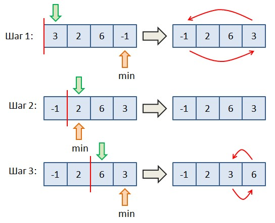

# Задача 5.6.6

Вводится список целых чисел в одну строку через пробел. Необходимо выполнить его сортировку выбором по возрастанию (не убыванию). Идея алгоритма очень проста и проиллюстрирована на рисунке ниже.



Вначале мы рассматриваем первый элемент списка и ищем второй минимальный относительно первого элемента (включая и его). На рисунке - это последний элемент со значением -1. Затем, меняем местами первый и последний элементы. Переходим ко второму элементу списка и повторяем эту же процедуру, но относительно второго элемента (то есть, первый уже не рассматриваем). На рисунке минимальный элемент - это 2, поэтому менять местами здесь ничего не нужно. Переходим к 3-му элементы со значением 6. Относительно него находим минимальный элемент - это 3. Меняем их местами.

Вот идея алгоритма сортировки выбором. Реализуйте его для вводимого списка целых чисел. Результат выведите в виде списка чисел одну строку через пробел.

Sample Input:

```python
8 11 -53 2 10 11
```

Sample Output:

```python
-53 2 8 10 11 11
```

Напишите программу. Тестируется через stdin → stdout
