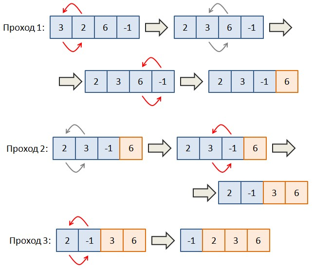

# Задача 5.6.7

Вводится список целых чисел в одну строку через пробел. Необходимо выполнить его сортировку по возрастанию (не убыванию) методом всплывающего пузырька. Идея алгоритма проста и показана на рисунке ниже.



При первом проходе перебираем все соседние пары элементов и если значение предыдущего элемента (слева) больше значения следующего (справа), то они меняются местами. (На рисунке 3 и 2 меняются местами). Следующая пара - это 3 и 6. Они уже выстроены по возрастанию, поэтому ничего не делаем и переходим к следующей паре 6 и -1. Меняем значения местами и видим, что на последнем месте находится максимальное значение 6, что нам и нужно.

При втором проходе делаем все то же самое, но доходим до предпоследнего элемента, так как последнее значение 6 уже отсортировано. На третьем проходе исключаем уже последние два элемента и так далее. То есть, в этом алгоритме достаточно сделать N-1 проходов, где N - длина списка.

Вот идея алгоритма сортировки всплывающего пузырька. Реализуйте его для вводимого списка целых чисел. Результат выведите в виде списка чисел одну строку через пробел.

Sample Input:

```python
4 5 2 0 6 3 -56 3 -1
```

Sample Output:

```python
-56 -1 0 2 3 3 4 5 6
```

Напишите программу. Тестируется через stdin → stdout
