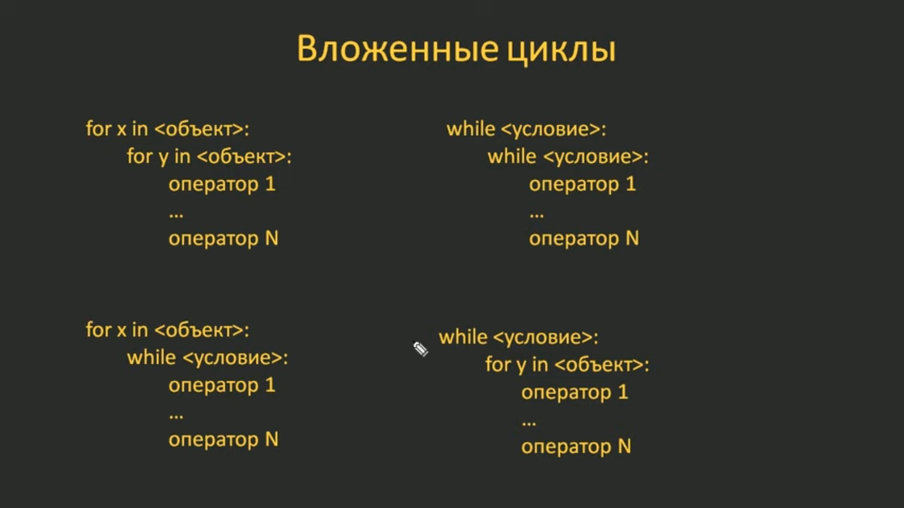
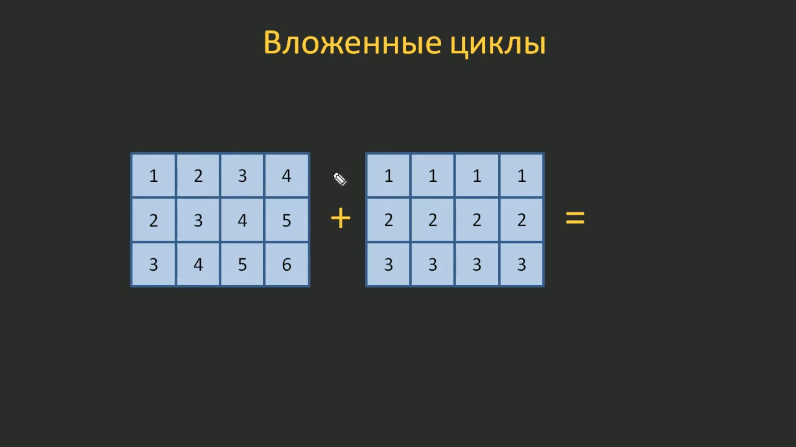
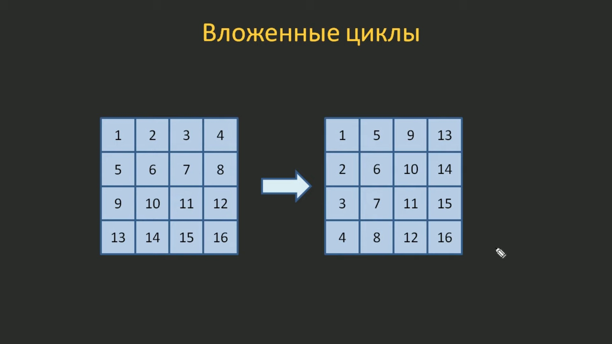

# 5.6. Вложенные циклы

На предыдущих занятиях мы с вами в деталях познакомились с работой операторов циклов `for` и `while`. На этом занятии сделаем следующий важный шаг и узнаем, как реализуются и работают вложенные циклы.

## 5.6.1. Два цикла for (один вложен в другой)

Само это название уже говорит, что один оператор цикла можно вложить в другой. Это могут быть два цикла `for` или два цикла `while` или смешанные варианты.



Давайте вначале разберемся, как работают эти конструкции. Принцип у всех един, поэтому, для простоты, возьмём два цикла `for` (один вложен в другой) и на этом примере рассмотрим как работают такие вложенные конструкции.

Для этого в файл `05.06.01.py` запишем программу, в которой эти циклы будут просто пробегать диапазоны чисел, первый от `1` до `3`, а второй - от `1` до `5`:

```python
for i in range(1, 4):
    for j in range(1, 6):
        print(f"i = {i}, j = {j}", end=" ")
    print()
```

Результатом выполнения программы будет:

```python
i = 1, j = 1 i = 1, j = 2 i = 1, j = 3 i = 1, j = 4 i = 1, j = 5
i = 2, j = 1 i = 2, j = 2 i = 2, j = 3 i = 2, j = 4 i = 2, j = 5
i = 3, j = 1 i = 3, j = 2 i = 3, j = 3 i = 3, j = 4 i = 3, j = 5
```

Т.е. каждая строка формируется во внутреннем цикле `for`, а переход на новую строку осуществляется при помощи оператора `print()`.

Смотрите какие значения у нас получаются.

На первом проходе внешнего цикла переменная `i` равна единице, а внутренний цикл перебирает `j` от `1` до `5`, что мы и видим в первой строке.

Для второй строчки у нас `i` принимает значение `2`, а `j` так же мняется от `1` до `5`.

И для третьей строчки - всё тоже самое, только `i` принимает значение `3`.

Вот именно таким образом работают вложенные циклы.1

И здесь возникает вопросы:

- Зачем всё это надо?
- Когда могут понадобиться такие вложенные конструкции?

## 5.6.2. Перебор элементов списка при помощи цикла for

Представим себе, что у нас есть вот такой вложенный список `[[1, 2, 3, 4], [2, 3, 4, 5], [3, 4, 5, 6]]` и мы хотели бы перебрать отдельные элементы этого вложенного списка `[1, 2, 3, 4]`. Как это можно сделать?

Попробуем перебрать элементы списка при помощи одного цикла `for` (файл `05.06.02.py`):

```python
a = [[1, 2, 3, 4], [2, 3, 4, 5], [3, 4, 5, 6]]
for row in a:
    print(row, type(row))
```

Результат:

```python
[1, 2, 3, 4] <class 'list'>
[2, 3, 4, 5] <class 'list'>
[3, 4, 5, 6] <class 'list'>
```

Мы получили строки с вложенными списками и тип `list`, т.е. каждый элемент является списком.

## 5.6.3. Перебор элементов вложенных списков при помощи вложенных циклов for

Как видите, оператор `for` перебирает вложенные списки в основном списке `a`. А если это так, то нам не что не мешает внутри оператора цикла `for` записать ещё один оператор `for`, который будет перебирать уже, непосредственно, сами вложенные списки (`05.06.03.py`):

```python
a = [[1, 2, 3, 4], [2, 3, 4, 5], [3, 4, 5, 6]]

for row in a:
    for x in row:
        print(x, type(x), end=" ")
    print()
```

Запустим эту программу:

```python
1 <class 'int'> 2 <class 'int'> 3 <class 'int'> 4 <class 'int'> 
2 <class 'int'> 3 <class 'int'> 4 <class 'int'> 5 <class 'int'> 
3 <class 'int'> 4 <class 'int'> 5 <class 'int'> 6 <class 'int'>
```

Смотрите, у нас везде фигурирует тип `int`, т.е. мы перебираем отдельные элементы вложенных списков и видим их значения.

Таким образом, мы при помощи двух вложенных циклов `for` перебрали все значения списка, который содержит вложенные списки.

## 5.6.4. Сложение двух списков при помощи вложенных циклов for

То что мы перебрали, это хорошо. Но всё же, для чего нам может это понадобиться?

Например, чтобы сложить элементы вот таких двух одинаковых по размеру списков:



Мы будем складывать соответствующие элементы между собой и на выходе получать определённые значения, т.е. мы получим на выходе список такой же размерности, а значения этого списка будут являться суммами соответствующих элементов входящих списков.

Как раз это можно сделать при помощи вложенных циклов (файл `05.06.04.py`):

```python
a = [[1, 2, 3, 4], [2, 3, 4, 5], [3, 4, 5, 6]]
b = [[1, 1, 1, 1], [2, 2, 2, 2], [3, 3, 3, 3]]
c = []

for i, row in enumerate(a):
    r = []  # список для формирования строки, содержащей суммы соответствующих элементов
    for j, x in enumerate(row):
        r.append(x + b[i][j])

    c.append(r)

print(c)
```

Теперь выполним эту программу:

```python
[[2, 3, 4, 5], [4, 5, 6, 7], [6, 7, 8, 9]]
```

Мы получили двумерный список с суммами соответствующих элементов входящих списков, т.е. мы просуммировали первый список со вторым.

Так с помощью вложенных циклов `for` можно решить такую задачу. И это лишь один маленький пример.

## 5.6.5. Удаление лишних пробелов при помощи вложенных циклов for и while

Давайте рассмотрим ещё один пример. Пусть у нас имеется текст, представленный в виде списка:

```python
t = ["- Скажи-ка,  дядя, ведь не даром",
    "Я Python выучил с   каналом",
    "Балакирев что    раздавал?",
    "Ведь были  ж заданья боевые,",
    "Да, говорят,  еще какие!",
    "Недаром помнит    вся Россия",
    "Как мы рубили   их тогда!"
]
```

Здесь в строках присутствуют два и более пробелов. Наша задача удалить их и оставить только один. Сделаем это с помощью вложенных циклов. В первом цикле `for` будем перебирать строки - элементы списка, а во втором (вложенном) цикле `while` удалять лишние пробелы (`05.06.05.py`):

```python
t = ["- Скажи-ка,  дядя, ведь не даром",
    "Я Python выучил с   каналом",
    "Балакирев что    раздавал?",
    "Ведь были  ж заданья боевые,",
    "Да, говорят,  еще какие!",
    "Недаром помнит    вся Россия",
    "Как мы рубили   их тогда!"
]

for i, line in enumerate(t):
    while line.count("  "):
        line = line.replace("  ", " ")

    t[i] = line

print(t)
```

Запустим программу:

```python
['- Скажи-ка, дядя, ведь не даром', 'Я Python выучил с каналом', 'Балакирев что раздавал?', 'Ведь были ж заданья боевые,', 'Да, говорят, еще какие!', 'Недаром помнит вся Россия', 'Как мы рубили их тогда!']
```

Как видите, в выводе программы всё отображается уже с одним пробелом.

Так можно решить эту задачу с помощью двух вложенных циклов.

## 5.6.6. Создание двумерного списка при помощи цикла for

Следующий пример. Предположим, что мы просим пользователя с клавиатуры ввести два целых значения `M` и `N`, это будут размерности двумерного списка (`05.06.06.py`):

```python
M, N = list(map(int, input("Введите M и N: ").split()))

zeros = []

for i in range(M):
    zeros.append([0] * N)

print(zeros)
```

Запустим программу, введём, к примеру, `M = 2` и `N = 3`:

```python
Введите M и N: 2 3
[[0, 0, 0], [0, 0, 0]]
```

## 5.6.7. Создание двумерного списка и замена всех нулевых элементов на единицы при помощи вложенных циклов for

А теперь, допустим, что нам нужно заменить все эти нулевые значения на единицы(`05.06.07.py`):

```python
M, N = list(map(int, input("Введите M и N: ").split()))

zeros = []

for i in range(M):
    zeros.append([0] * N)

print(zeros)

for i in range(M):
    for j in range(N):
        zeros[i][j] = 1
print(zeros)
```

Выполним программу:

```python
Введите M и N: 2 3
[[0, 0, 0], [0, 0, 0]]
[[1, 1, 1], [1, 1, 1]]
```

Изначально мы получили список из нулей, а затем заменили их на единицы.

Как видите, с помощью вложенных циклов мы можем легко и просто работать с такими двумерными данными.

## 5.6.8. Замена значений строк на значения столбцов в двумерном списке при помощи вложенных циклов for

Ну и последний пример, который мы рассмотрим на этом занятии. Предположим, что у нас есть вот такой двумерный список:

```python
A = [[1, 2, 3, 4], [5, 6, 7, 8], [9, 10, 11, 12], [13, 14, 15, 16]]
```

и нам нужно заменить значения его строк на значения его столбцов, т.е. сделать такое преобразование:



Как это сделать?

Смотрите, все элементы на главных диагоналях до преобразования и после - повторяются, их трогать не надо. А дальше все элементы стоящие выше главной диагонали нужно поменять с соответствующими элементами расположенными ниже главной диагонали.

Рассмотрим как это сделать. Делается это очень просто.

Мы возьмём два вложенных цикла. Первый будет идти по `i` от `0`, до `3`, а второй цикл - по `j` от `i + 1` и идти до конца. В итоге мы переберём все элементы стоящие выше главной диагонали. А чтобы их поменять с элементами стоящими ниже главной диагонали достаточно выполнить такую операцию:

```python
A[i][j], A[j][i] = A[j][i], A[i][j]
```

Реализуем эту программу:

```python
A = [[1, 2, 3, 4], [5, 6, 7, 8], [9, 10, 11, 12], [13, 14, 15, 16]]

for i in range(len(A)):
    for j in range(i + 1, len(A)):
        A[i][j], A[j][i] = A[j][i], A[i][j]

for r in A:
    for x in r:
        print(x, end="\t")
    print()
```

Запустим нашу программу:

```python
1   5   9   13
2   6   10  14
3   7   11  15
4   8   12  16
```

Всё сработало так как мы и хотели. В математике такое преобразование называется **транспонированием матрицы**.

Вообще, уровень вложенности циклов может быть любым - два, три, четыре и больше. Однако, на практике слишком большого уровня вложенности циклов следует избегать, потому что программа становится менее читабельной и гибкой для дальнейшего изменения. Лучше ограничиться максимум тремя уровнями вложения. Если получается больше, то скорее всего, у вас неправильно построена структура программы и её следует пересмотреть.
