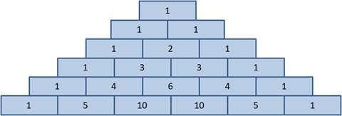
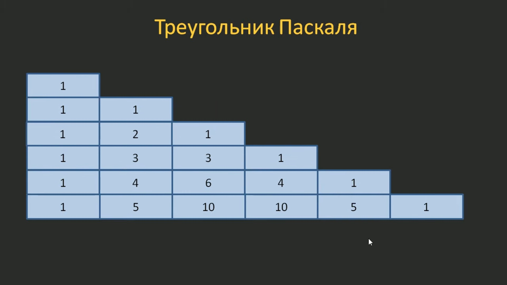
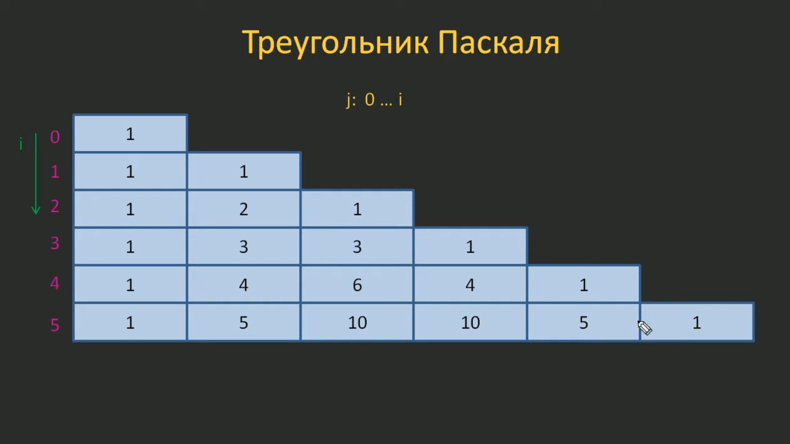
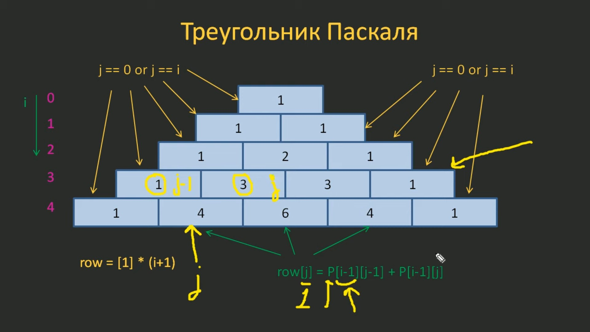

# 5.7. Треугольник Паскаля как пример работы вложенных циклов

На этом занятии мы с вами напишем программу для построения треугольника Паскаля.

Этот треугольник состоит из особых чисел, которые вычисляются по правилу: по краям каждой строки стоят единицы, а каждое из остальных чисел равно сумме двух стоящих над ним из предыдущей строки. Таким образом формируются все числа треугольника Паскаля, кроме "граничных", которые всегда равны единице.

Именно в таком виде его привел французский математик Блез Паскаль в "Трактате об арифметическом треугольнике". Популярность этого треугольника возникла из-за того, что эти числа довольно часто встречаются в самых разных задачах математики: алгебре, комбинаторике, теории вероятностей и многих других.

Мы сейчас не будем вдаваться в их анализ, так как перед нами стоит несколько другая задача - написать программу формирования такого треугольника.



Первый вопрос, на который, обычно, требуется ответить при разработке новой программы - как хранить данные? В данном случае, как хранить эти числа? Я это сделаю с помощью неравномерного вложенного списка. Смотрите, весь этот треугольник можно представить как набор вложенных списков постоянно увеличивающейся длины:



Т.е. у нас сначала будет вложенный список в один элемент, потом в два элемента, в три элемента и так далее.

Вот именно в таком виде мы и представим в нашей программе треугольник Паскаля. Описать его можно с помощью такой конструкции:

```python
P = [
    [1],
    [1, 1],
    [1, 2, 1],
    ...
]
```

Далее в программе мы будем формировать все эти числовые значения следующим образом:



У нас будет два счётчика:

- счётчик строк `i`, который меняется от нуля и т.д.;
- счётчик элементов `j`, который меняется от нуля до `i`.

Т.е. для первой строки `j` будет принимать всего одно значение `0`, т.к. `i` равен нулю. Для второй строки `j` будет принимать уже два значения `0` и `1`, т.к. `i` здесь равен единице. И так далее.

Таким образом, меняя `j` в диапазоне от `0` до `i`, мы будем перебирать все элементы вложенных списков. И перебирая их формировать конкретные числовые значения.

Рассмотрим теперь принцип алгоритма по которому мы будем формировать эти числа.

Мы сделаем следующим образом. Каждая новая строка будет формироваться по такому правилу:

```python
row = [1] * (i + 1)
```

Т.е. мы будем изначально создавать список состоящий из единиц длинной `i + 1`, потому что `i` начинает отсчитываться с нуля и чтобы первый список был длинной `1`, второй - `2` и так далее.

Из этого мы получаем треугольник состоящий из одних единичек:

```python
P = [
    [1],
    [1, 1],
    [1, 1, 1],
    [1, 1, 1, 1],
    ...
]
```

Формировать значения необходимые для построения треугольника Паскаля мы будем следующим образом, из предыдущей строки будем брать значения, которые стоят над формируемым значением и складывать их.

Но как это действие описать на уровне программы?

Во-первых, мы будем изменять значения для счётчика `j`, которые будут определять все значения кроме крайних.

Какие индексы у крайних значений?

Это `0` и `i`. Т.к. индекс `0` имеет первое значение в строке, а индекс `i` - последнее.

Эти значения менять не нужно, там уже записаны единички. А вот остальные значения мы будем изменять.

Для этого берём элементы из предыдущей строки `P[i - 1]` с индексами `P[i - 1][j - 1]` и `P[i - 1][j]` и складываем их:



Т.е. мы вычисляем значение конкретного элемента треугольника Паскаля так:

```python
P[i][j] = P[i - 1][j - 1] + P[i - 1][j]
```

Теперь нам осталось всё это запрограммировать (файл `05.07.01.py`):

```python
N = 7  # определяет глубину треугольника Паскаля
P = []  # коллекция, которая представляет треугольник Паскаля. Пока пустой список

for i in range(N):  # первый цикл, который создает строки треугольника Паскаля
    row = [1] * (i + 1)  # создаем треугольник из единиц
    for j in range(i + 1):  # второй цикл, который формирует строку треугольника Паскаля
        if j != 0 and j != i:
            row[j] = P[i - 1][j - 1] + P[i - 1][j]

    P.append(row)  # добавляем полученную строку в треугольник Паскаля

for r in P:  # цикл для построчного вывода треугольника Паскаля
    print(r)
```

Запустим полученную программу:

```python
[1]
[1, 1]
[1, 2, 1]
[1, 3, 3, 1]
[1, 4, 6, 4, 1]
[1, 5, 10, 10, 5, 1]
[1, 6, 15, 20, 15, 6, 1]
```

Видим, что у нас как раз сформировался треугольник Паскаля с нужными значениями. И как видите для формирования треугольника Паскаля у нас получилась довольно простая программа.

Но необходимо помнить, что все приведённые программы не являются истинной в последней инстанции. У вас могут получиться другие программные реализации той же самой задачи.

Здесь главное помнить, что лучшей реализацией будет та, которая будет расходовать меньше памяти и работать быстрее. Это два самых главных критерия построения любых программ.

И разумеется, выполнение программы должно приводить к корректным результатам, иначе их можно считать не работоспособными.

Надеюсь, из этого занятия вы хорошо себе представили, как можно запрограммировать задачу формирования треугольника Паскаля с произвольным числом строк.

Чтобы избежать несколько сравнений одной и той же переменной (`if j != 0 and j != i:`) можно записать программу так:

```python
N = int(input())

P = []

for i in range(N):
    row = [1] * (i + 1)
    for j in range(i + 1):
        if j not in [0, i]:
            row[j] = P[i - 1][j - 1] + P[i - 1][j]

    P.append(row)

for r in P:
    print(r)
```
