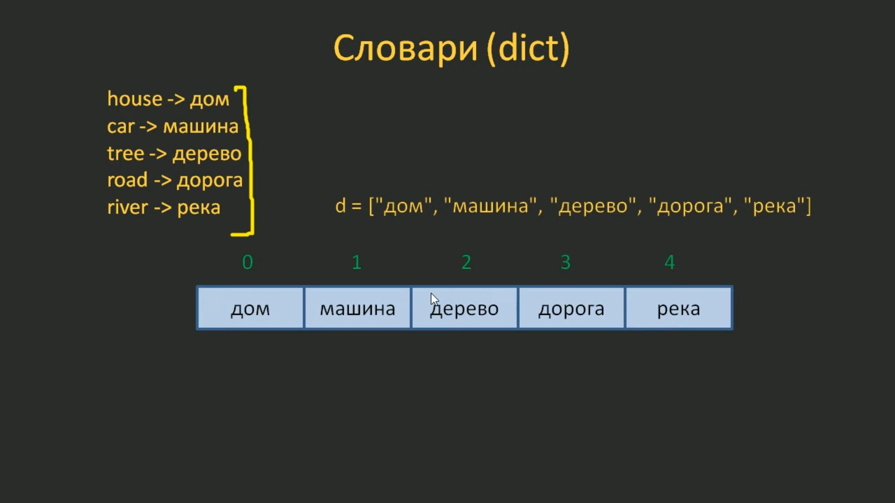
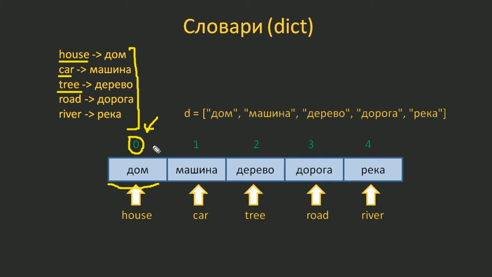

# 6.1. Введение в словари (dict). Базовые операции над словарями

## 6.1.1. Что такое словарь (dict) в Python

Мы продолжаем курс по языку Python. На этом занятии мы с вами познакомимся с новой конструкцией коллекций - словарем. Давайте представим, что мы в программе хотели бы описать, следующие соответствия:

house -> дом
car -> машина
tree -> дерево
road -> дорога
river -> река

Как это сделать?

Если воспользоваться теми знаниями, что у нас уже есть и с помощью списка описать такую коллекцию, по крайней мере, русские слова, то у нас получится, что каждому элементу, каждому слову будет соответствовать некое число - индекс:



и мы по этому индексу можем получать этот элемент.

Но нам в данном случае нужно сделать несколько другую операцию. Нам нужно получать нужный элемент по ключам, которыми являются английские слова в нашей изначальной коллекции. Т.е. вместо числовых ключей (индексов) мы бы хотели использовать другие ключи, ключи на уровне слов:



Вот как раз такое соответствие и позволяет описывать словарь в языке Python. Чтобы его задать используете следующий синтаксис:

```python
{key1: value1, key2: value2, ..., keyN: valueN}
```

Т.е. ставятся фигурные скобки и внутри этих скобок прописываются пары `ключ: значение`.

Рассмотрим работу со словарями на конкретных примерах.

Зададим следующий словарь (файл `06.01.01.py`), выведем его в консоль и посмотрим, что получится:

```python
d = {
    "house": "дом",
    "car": "машина",
    "tree": "дерево",
    "road": "дорога",
    "river": "река",
}

print(d)
```

Запустим программу:

```python
{'house': 'дом', 'car': 'машина', 'tree': 'дерево', 'road': 'дорога', 'river': 'река'}
```

И мы действительно увидели все пары ключ-значение, которые содержатся в этом словаре.

Возникает вопрос, как всем этим можно пользоваться?

Давайте разберёмся с этим вопросом. Для этого перейдём в консоль Python. Здесь будет удобнее показывать работу со словарём.

Определяем этот словарь:

```python
>>> d = {'house': 'дом', 'car': 'машина', 'tree': 'дерево', 'road': 'дорога', 'river': 'река'}
>>>
```

И, предположим, мы хотим получить первое значение словаря "дом". Для этого мы пишем словарь `d` и в квадратных скобках указываем соответствующий ключ:

```python
>>> d["house"]
'дом'
>>>
```

и на выходе мы получаем соответствующее значение, значение которое связано с ключом "house".

Или возьмём другой, какой-нибудь ключ, например "car":

```python
>>> d["car"]
'машина'
>>>
```

Если же мы укажем не существующий ключ, например `100`:

```python
>>> d[100]
Traceback (most recent call last):
  File "<stdin>", line 1, in <module>
KeyError: 100
```

то получим ошибку.

На это обращайте внимание. П**ри обращении к словарю можно использовать только существующие ключи**.

Также следует помнить, что одному ключу в словаре соответствует только одно значение. Например, если мы пропишем такой словарь, где два одинаковых ключа имеют разные значения:

```python
>>> d = {"house": "дом", "house": "дом 2", "car": "машина"}
>>> d
{'house': 'дом 2', 'car': 'машина'}
>>>
```

 то в итоге мы получим словарь с одним ключом `house` и одним последним значением `дом 2`.

 Т.е. **один ключ ссылается всегда на одно конкретное значение**.

Итак, что нужно помнить о словарях в Python?

**Словари** используются для хранения значений данных в парах `ключ: значение`.

**Словарь** — это упорядоченная, изменяемая и не допускающая дубликатов ключей коллекция.

Также необходимо знать, что словари упорядочены начиная с версии Python 3.7. В Python 3.6 и более ранних версиях словари не упорядочены.

## 6.1.2. Функция `dict()`

 Для понимания словаря в Python, я думаю, изложенного выше в целом достаточно. Но в языке Python мы можем задавать словарь при помощи специальной функции `dict()`.

**Функция `dict()`** - это функция, которая принимает в качестве аргументов **набор пар ключ-значение** и возвращает словарь, т.е. создает словарь.

Синтаксис:

```python
dict(keyword arguments)
```

Необязательные параметры:

`keyword arguments` - Сколько угодно аргументов `ключ: значение`, разделенных запятой: `ключ_1=значение_1, ключ_2=значение_2,..., ключ_N=значение_N`.

Т.е. в параметрах функции `dict()` прописываются пары `ключ: значение`, причём ключи должны быть обязательно строками и записываются без кавычек.

Например мы можем воспользоваться этой функцией следующим образом:

```python
>>> d = dict(one=1, two=2, three='3', four='4')
>>> d
{'one': 1, 'two': 2, 'three': '3', 'four': '4'}
>>>
```

Как видите, на выходе мы получили словарь, где все ключи определяются теперь как строки. Причём в именах этих ключей можно использовать только те символы и последовательности символов, которые разрешены в именах переменных.

Так например, если мы назовём переменную `a1`:

```python
>>> a1 = 1
>>> a1
1
>>>
```

то никаких проблем не будет.

А переменную с именем `1a`:

```python
>>> 1a = 1
  File "<stdin>", line 1
    1a = 1
    ^
SyntaxError: invalid decimal literal
>>>
```

мы задать уже не можем, будет ошибка.

Также всё работает и при именовании ключей в словарях, например сделаем так:

```python
>>> d = dict(1=one, two=2, three='3', four='4')
  File "<stdin>", line 1
    d = dict(1=one, two=2, three='3', four='4')
             ^^
SyntaxError: expression cannot contain assignment, perhaps you meant "=="?
>>>
```

причина ошибки в том, что такое имя для ключа `1` не допустимо.

Здесь можно подумать: зачем нам использовать такую сложную функцию `dict()` для создания словаря? Ведь можно использовать фигурные скобки и, в этом случае, можно прописывать любые названия для ключей, а при использовании функции `dict()` существуют такие строгие ограничения.

Всё верно и чаще всего словарь определяют, именно, при помощи фигурных скобок. Но иногда бывают ситуации, когда функция `dict()` бывает полезной. Например, давайте представим, что у нас есть следующий список:

```python
>>> lst = [[2, "неудовлетворительно"], [3, "удовлетворительно"], [4, "хорошо"], [5, "отлично"]]
>>> lst
[[2, 'неудовлетворительно'], [3, 'удовлетворительно'], [4, 'хорошо'], [5, 'отлично']]
>>>
```

Этот список содержит несколько вложенных списков, причём вложенные списки содержат два элемента. И такой список можно превратить в словарь, где каждый вложенный список будет интерпретироваться как пара ключ-значение. И преобразовать его можно при помощи всё той же функции `dict()`:

```python
>>> d = dict(lst)
>>> d
{2: 'неудовлетворительно', 3: 'удовлетворительно', 4: 'хорошо', 5: 'отлично'}
>>>
```

Как видите здесь в качестве имени ключа у же можно использовать, и числа и строки, и некоторые другие типы данных.

Если же функцию `dict()` вызвать без аргументов:

```python
>>> d = dict()
>>> d
{}
>>>
```

то на выходе получим пустой словарь.

Это, кстати, эквивалентно случаю, когда мы введём пустые фигурные скобки:

```python
>>> d = {}
>>> d
{}
>>>
```

Ну, а теперь, один из главных вопросов при работе со словарями - что можно использовать в качестве ключей?

Мы в наших примерах использовали числа и строки, а что можно ещё использовать, какие типы данных?

На самом деле мы можем брать любые не изменяемые типы данных.

Например:

```python
>>> d[True] = "Истина"
>>> d
{True: 'Истина'}
>>>
```

также:

```python
>>> d[False] = "Ложь"
>>> d
{True: 'Истина', False: 'Ложь'}
>>>
```

Теперь у нас в словаре два элемента, с двумя ключами. Т.е. присваивая словарю новое значение с новым ключом мы автоматически добавляем эту пару в словарь.

Если же мы существующему ключу присвоим какое-либо другое значение:

```python
>>> d[True] = 1
>>> d
{True: 1, False: 'Ложь'}
>>>
```

то оно просто изменится.

А можем ли мы в качестве ключа указать список, например:

```python
>>> d[[1, 2]] = 1
Traceback (most recent call last):
  File "<stdin>", line 1, in <module>
TypeError: unhashable type: 'list'
>>>
```

В этом случае мы получим ошибку. и это произошло потому, что список относится к изменяемым типам данных.

Таким образом мы можем использовать для именования ключа, например, булевы значения, числа, строки, а вот списки уже нельзя. Но это то, что касается ключей. В качестве значения можно использовать абсолютно любые типы данных:

```python
>>> d = {True: 1, False: "Ложь", "list": [1, 2, 3], 5: 5}
>>> d
{True: 1, False: 'Ложь', 'list': [1, 2, 3], 5: 5}
>>>
```

Такой словарь мы вполне можем определить.

Как видите в качестве значения может выступать как изменяемый объект, так и неизменяемый. А вот в качестве ключа - только неизменяемый.

## 6.1.3. Некоторые операторы и функции для работы со словарями

В заключении нашего занятия рассмотрим некоторые операторы и функции для работы со словарями.

### 6.1.3.1. Определение количества элементов в словаре. Функция `len()`

Если мы хотим определить количество элементов в словаре, то можем для этого использовать, известную уже нам функцию `len()`:

```python
>>> len(d)
4
>>>
```

В данном случае она возвращает `4`, т.к. словарь содержит четыре пары ключ-значение.

### 6.1.3.2. Удаление пар ключ-значение из словаря. Оператор `del`

Для удаления пары ключ-значение из словаря используется оператор `del`:

```python
>>> del d[True]
>>> d
{False: 'Ложь', 'list': [1, 2, 3], 5: 5}
>>>
```

Теперь элемент `True` удалён из словаря.

Если же мы попытаемся удалить из словаря несуществующий ключ:

```python
>>> del d[abc]
Traceback (most recent call last):
  File "<stdin>", line 1, in <module>
NameError: name 'abc' is not defined. Did you mean: 'abs'? Or did you forget to import 'abc'?
>>>
```

то получим ошибку. Т.е. удалять можно только существующие ключи.

### 6.1.3.3. Проверка наличия ключа в словаре. Операторы `in` и `not in`

Но как же проверить есть какой-либо ключ в словаре или нет. Для этого можно использовать оператор `in`:

```python
>>> "abc" in d
False
>>>
```

Как вы уже поняли оператор `in` возвращает `True`, если ключ есть в словаре, и `False` в противном случае. Причём эта проверка относится именно к ключам. Т.е. если мы проверим таким образом наличие, например значения `[1, 2, 3]` в словаре:

```python
>>> [1, 2, 3] in d
Traceback (most recent call last):
  File "<stdin>", line 1, in <module>
TypeError: unhashable type: 'list'
>>>
```

то оператор `in` возвратит ошибку, указывающую, что в качестве ключа нельзя использовать изменяемый тип данных.

Попробуем проверить наличие значения `"Ложь"` в словаре (оно является неизменяемым):

```python
>>> "Ложь" in d
False
>>>
```

В этом случае мы видим `False`.

**Таким образом проверка при помощи оператора `in` проверяет именно ключи, а не значения**. Имейте это в виду.

Проверить же на отсутствие ключа в словаре можно с помощью оператора `not in`:

```python
>>> "Ложь" not in d
True
>>>
```

В этом случае мы видим `True`. Т.е ключ `"Ложь"` не входит в этот словарь `d`.

После изучения материала этого занятия вы должны узнать:

- что такое словарь, как его можно задавать;
- как обращаться к элементам этой коллекции по ключам;
- познакомиться с функцией `dict()`;
- познакомиться с функцией `len()`;
- познакомиться с операторами `in`, `not in` и `del`.
