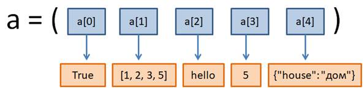

# 6.3. Кортежи (tuple) и их методы

## 6.3.1 Определение кортежа

На этом занятии мы с вами познакомимся с еще одной новой коллекцией данных - кортежами. Что такое кортеж?

**Кортеж** - это упорядоченная, но неизменяемая коллекция произвольных данных.

Кортежи, в целом, аналогичны спискам, но в отличие от них, элементы кортежей менять нельзя - это неизменяемый тип данных.

## 6.3.2. Способы создания кортежей

Рассмотрим на конкретных примерах как задаются кортежи и какие операции с ними можно выполнять.

Для этого перейдём в консоль Python:

```bash
$ python
>>>
```

Для задания кортежа достаточно перечислить значения через запятую:

```python
>>> a = 1, 2
>>> a
(1, 2)
>>>
```

мы видим при выводе значение переменной `a` заключено в круглые скобки. Эти круглые скобки, как раз и говорят о том, что это кортеж.

Т.е. кортежи отображаются и задаются через круглые скобки. Когда мы присваивали значение переменной `a`, мы не использовали круглые скобки, а просто перечислили данные через запятую, но в таком случае интерпретатор языка Python предполагает, что мы задаём кортеж.

Мы можем прописать круглые скобки и в явном виде:

```python
>>> a = (1, 2, 3)
>>> a
(1, 2, 3)
>>>
```

Т.о. тоже можно задать кортеж. Т.е. мы можем, в таком случае, как прописывать круглые скобки, так и обходиться без них. Результат будет один и тот же.

Но, обратите внимание, при определении кортежа с одним значение, следует использовать такой синтаксис:

```python
>>> b = 1,
>>> b
(1,)
>>>
```

или

```python
>>> b = (2,)
>>> b
(2,)
>>>
```

Здесь висячая запятая указывает, что единицу следует воспринимать как первый элемент кортежа, а не как число 1. Без запятой - это будет уже просто число один. Вот это нужно очень хорошо запомнить, начинающие программисты здесь часто делают ошибку, не прописывая висячую запятую.

## 6.3.3. Распаковка кортежей

Далее обратим внимание на то, что, если у нас есть такой кортеж - `(1, 2)`, то мы можем сразу его распаковать в отдельные переменные:

```python
>>> x, y = (1, 2)
>>> x
1
>>> y
2
>>>
```

в итоге у нас переменная `x` будет принимать первое значение `1`, а переменная `y` - второе значение `2`.

Если у нас кортеж состоит из трех значений, то для того, чтобы распаковать его, соответственно требуется 3 переменных:

```python
>>> x, y, z = (3, 4, 5)
>>>
```

Но, если число переменных не будет совпадать с числом элементов кортежа:

```python
>>> x, y = (1, 2, 3)
Traceback (most recent call last):
  File "<stdin>", line 1, in <module>
ValueError: too many values to unpack (expected 2)
>>>
```

то возникнет ошибка.

Кстати, мы можем прописать это и без круглых скобок:

```python
>>> x, y, z = 3, 4, 5
>>>
```

это как раз и есть синтаксис множественного присвоения, когда мы каждой переменной присваиваем своё строго определенное значение.

Тоже самое можно делать и используя списки, например:

```python
>>> x, y = ["hello", "python"]
>>> x
'hello'
>>> y
'python'
>>>
```

Т.е. такие операции распаковки работают не только с картежами, но и со списками и с любыми итерируемыми объектами словарями, строками и т.д. Например, рассмотрим распаковку строки:

```python
>>> x, y = "ra"
>>> x
'r'
>>> y
'a'
>>>
```

## 6.3.4. Определение длины кортежа

Но вернёмся к кортежам. И посмотрим как можно определить количество элементов в кортеже:

```python
>>> a = (1, 2, 3)
>>> len(a)
3
>>>
```

## 6.3.5. Индексы и срезы кортежей

Если же нам нужно обратиться к к какому-то отдельному элементу кортежа, то используется обычный синтаксис с квадратными скобками, в которых указываем индекс того элемента, к которому мы хотим обратиться:

```python
>>> a[0]
1
>>>
```

Индексирование здесь как и со списками.

И срезы кортежей работают точно так же как и в списках.

Поэтому говорить об этом подробно не будем, но рассмотрим несколько примеров:

```python
>>> a[1:2]
(2,)
>>> a[0:2]
(1, 2)
>>>>>> a[:2]
(1, 2)
>>>
```

Единственное отличие при работе со срезами в кортежах и списках заключается в следующем:

При получении полного среза списка `a[:]` создавалась копия списка. При работе с кортежами копия в таком случае не создаётся.

Этот момент нужно также очень хорошо запомнить: для кортежей - возвращается тот же самый объект, а для списков - создается копия.

Если записать так:

```python
>>> b = a[:]
>>> b
(1, 2, 3)
>>>
```

То `b` будет ссылаться на тот же самый кортеж, что и `a`. В этом легко убедиться:

```python
>>> id(a)
131246011238720
>>> id(b)
131246011238720
>>>
```

У нас тут получатся абсолютные одинаковые значения. Это и говорит о том, что `b` ссылается на то же самый объект, что и `a`.

Здесь нужно быть осторожным. Когда мы берём полный срез кортежа, то его копия не создается. А при работе со списками - создается.

## 6.3.6. Преимущества кортежей перед списками

Некоторые из вас сейчас могут задаваться вопросом: зачем было придумывать кортежи, если списки способны выполнять тот же самый функционал? И даже больше - у них можно менять значения элементов, в отличие от кортежей? Да, все верно, по функциональности списки шире кортежей, но у последних все же есть свои преимущества.

**Во-первых**, то, что кортеж относится к неизменяемому типу данных, то мы можем использовать его, когда необходимо "запретить" программисту менять значения элементов списка. Например, вот такая операция:

```python
>>> >>> a[1] = 100
Traceback (most recent call last):
  File "<stdin>", line 1, in <module>
TypeError: 'tuple' object does not support item assignment
>>>
```

приведет к ошибке. Менять значения кортежей нельзя.

А если кортеж относится к неизменяемым типам данных, то мы можем использовать его в качестве ключей в словарях.

**Во-вторых**, кортежи можно использовать в качестве ключей у словарей, например, так:

```python
>>> d = {}
>>> d[a] = "кортеж"
>>> d
{(1, 2, 3): 'кортеж'}
>>>
```

Напомню, что списки как ключи применять недопустимо, так как список - это изменяемый тип, а ключами могут быть только неизменяемые типы и кортежи здесь имеют преимущество перед списками.

**В-третьих**, кортеж занимает меньше памяти, чем такой же список, например:

```python
>>> lst=[1, 2, 3]
>>> a = (1, 2, 3)
>>> print(lst.__sizeof__())
72
>>> print(a.__sizeof__())
48
>>>
```

Как видите, размер кортежа меньше (48 байт), чем списка (72 байта).

Здесь использован метод **sizeof**, который возвращает размер данных в байтах.

Из всего этого можно сделать такой общий вывод: если мы работаем с неизменяемым упорядоченным списком, то предпочтительнее использовать кортеж.

Теперь, когда мы поняли, что кортежи играют свою значимую роль в программах на Python, вернемся к их рассмотрению.

## 6.3.7. Пустой кортеж. Объединение кортежей. Создание кортежей. Вложенные кортежи

Чтобы создать пустой кортеж можно просто записать круглые скобки:

```python
>>> a = ()
>>> a
()
```

или воспользоваться специальной встроенной функцией:

```python
>>> b = tuple()
>>> b
()
>>> print(type(a), type(b))
<class 'tuple'> <class 'tuple'>
>>>
```

Но здесь сразу может возникнуть вопрос: зачем создавать пустой кортеж, если он относится к неизменяемым типам данных? Слово неизменяемый наводит на мысль, что вид кортежа остается неизменным. Но это не совсем так. В действительности, мы лишь не можем менять уже существующие элементы в кортеже, но можем создавать новые, используя оператор +, например:

```python
>>> a = a +  (1,)
>>> a
(1,)
>>>
```

На выходе мы получили новый кортеж с объединёнными значениями.

Или для добавления данных в начало кортежа:

```python
>>> a = (2, 3) + a
>>> a
(2, 3, 1)
>>>
```

Также операцию `a = a +  (1,)` можно записать в более краткой форме. Например, так, используя вложенный кортеж:

```python
>>> a += (("a", "hello"),) # Не забывайте про запятую в конце
>>> a
(2, 3, 1, ('a', 'hello'))
>>>
```

У нас получилось, что в один кортеж вложен другой кортеж.

Также мы можем создавать кортеж вот таким образом, создаём кортеж из одного элемента и дублируем его несколько раз через оператор *, подобно спискам:

```python
>>> b = (0,) * 10
>>> b
(0, 0, 0, 0, 0, 0, 0, 0, 0, 0)
>>>
```

В итоге кортеж `b` будет состоять из десяти нулей.

Тоже самое мы можем сделать и с таким кортежем:

```python
>>> b = ("hello", "world") * 5
>>> b
('hello', 'world', 'hello', 'world', 'hello', 'world', 'hello', 'world', 'hello', 'world')
>>>
```

Как видите, все эти операции вполне допустимы.

Так можно формировать кортежи. Но в уже сформированном кортеже мы не можем удалять уже существующие элементы или изменять их как-то. Например:

```python
>>> del a[1]
Traceback (most recent call last):
  File "<stdin>", line 1, in <module>
TypeError: 'tuple' object doesn't support item deletion
>>>
```

то возникнет ошибка: "Объект 'кортеж' не поддерживает удаление элемента". Со списками такая операция была бы возможна.

Правда, можно удалить объект целиком, весь кортеж: `del a`, тогда кортеж просто перестанет существовать, не будет даже пустого кортежа, здесь объект удаляется целиком.

А теперь рассмотрим более подробно функцию `tuple()`.

## Функция 'tuple()'

**Функция `tuple()`** - функция, которая создает объект кортежа.

*Примечание*. Вы не можете изменять или удалять элементы в кортеже.

Синтаксис:

```python
tuple(iterable)
```

Необязательный параметр:

`iterable` - Последовательность, коллекция или объект-итератор.

С помощью функции `tuple()` можно создавать кортежи на основе любого итерируемого объекта, например, списков:

```python
a = tuple([1, 2, 3])
>>> a
(1, 2, 3)
>>>
```

В данном случае мы получили кортеж с теми же самыми значениями, что были в списке.

Так же можно создать кортеж из строки, ведь она тоже является итерируемым объектом:

```python
>>> a = tuple("hello")
>>> a
('h', 'e', 'l', 'l', 'o')
>>>
```

Мы получили кортеж из отдельных символов этой строки.

А если нам нужно превратить кортеж в список, то подойдет известная нам функция `list()`, которая формирует список также из любого итерируемого объекта:

```python
>>> t = (1, 2, 3)
>>> t
(1, 2, 3)
>>> lst = list(t)
>>> lst
[1, 2, 3]
>>>
```

Так как кортеж - это перебираемый, то есть, итерируемый объект, то ничто не мешает нам превращать его в список.

Как я отмечал в самом начале, кортежи могут хранить самые разные данные. Допустим у нас есть такой кортеж, состоящий из самых разных типов данных:

```python
>>> a = (True, [1, 2, 3], "hello", 5, {"house": "дом"})
>>> a
(True, [1, 2, 3], 'hello', 5, {'house': 'дом'})
>>>
```

Т.е. всё это вполне возможно помещать в кортежи.

Теперь мы сделаем следующее. Если обратиться к списку данного кортежа - [1, 2, 3], то получим именно этот список:

```python
>>> a[1]
[1, 2, 3]
>>>
```

Но так как список это изменяемый объект, следовательно, его значение даже в кортеже мы можем спокойно менять:

```python
>>> a[1].append("5")
>>> a
(True, [1, 2, 3, '5'], 'hello', 5, {'house': 'дом'})
>>>
```

Как видите, мы не получили никаких ошибок и сам список в кортеже изменился.

То есть, неизменность кортежа относится к его структуре элементов и значениям ссылок на объекты. Но, если сами объекты, при этом, могут меняться, то мы можем легко это делать. То есть, обращаясь ко второму элементу кортежа, мы, фактически, имеем список, с которым возможны все его операции без каких-либо ограничений.

Т.е. здесь вот что происходит:



Ссылки, которые на`рис. 6.3.2`, находятся в верхнем ряду (обозначены голубым цветом) менять нельзя после того как они определены. И теперь смотрите, ссылка `a[1]` - это, фактически, переменная, которая ссылается на список `[1, 2, 3, '5']`. А если переменная ссылается на список, то что нам мешает через эту переменную менять содержимое этого списка, добавлять в него элементы, удалять и т.д. Потому что сам по себе список это изменяемый тип данных.

Этот момент следует очень хорошо себе представлять. Неизменными в кортеже являются только ссылки на объекты. А сами объекты меняются или нет зависит от их типа данных. Так например, если мы захотим изменить значение `a[0]` - `True` на `False`, то сделать мы этого не сможем. Потому что будет создаваться новый объект со значением `False` и ссылка a[0] должна будет указывать на этот новый объект. А в кортеже этого делать нельзя. Т.е. в кортеже ссылки, которые уже определены, нельзя менять. А когда мы работаем с ссылкой `a[1]`, которая указывает на список, то эта ссылка никак не меняется, т.к. новый объект не создается, меняется сам объект, являющийся списком. Именно поэтому мы можем изменять в кортежах изменяемые объекты, в том числе и списки.

В заключение этого занятия рассмотрим два метода, которые часто используются в кортежах:

- `tuple.count(значение)`;
- `tuple.index(значение[, start[, stop]])`.

**Метод `count()`** - возвращает количество раз, когда указанное значение появляется в кортеже.

Синтаксис:

```python
tuple.count(value)
```

Обязательный параметр:

`value` - Значение, которое мы ищем в кортеже.

**Метод `index()`** - находит первое вхождение указанного значения. Этот метод вызывает исключение, если значение не найдено.

Синтаксис:

```python
tuple.index(value)
```

Обязательный параметр:

`value` - Значение, которое мы ищем в кортеже.

Давайте, на конкретных примерах, рассмотрим как работают эти методы.

Для примера создадим кортеж и для него вызовем метод `count()` и будем искать элемент `"abc"`:

```python
>>> a = ("abc", 2, [1,2], True, 2, 5)
>>> a
('abc', 2, [1, 2], True, 2, 5)
>>> a.count("abc")
1
>>>
```

Метод `count()` возвратил `1`, потому что элемент `"abc"` встречается в кортеже ровно один раз.

А если мы посчитаем количество элементов с значением `2`:

```python
>>> a.count(2)
2
>>>
```

то метод `count()` вернет `2`, т.к. элемент `2` встречается в кортеже дважды.

Как видите, метод count() возвращает число таких элементов в кортеже. Если же элемент не будет найден:

```python
>>> a.count("hello")
0
>>>
```

то возвращается `0`.

Второй метод `index()` работает, в общем, аналогично, только возвращает индекс первого вхождения. Например:

```python
>>> a.index(2)
1
>>>
```

Т.е. метод `index()` нашёл первую `2` возвратил индекс этого элемента и дальше поиск делать не стал.

Если же нам нужно провести поиск в части кортежа после первой двойки, то нужно писать метод индекс следующим образом:

```python
>>> a.index(2, 2)
4
>>>
```

Результатом будет `4`. Т.е. первой нашлась двойка в указной части кортежа под индексом `4`.

А если сделать такую запись `a.index(2, 2, 3)`, то поиск будет проходить только в элементе под индексом `2` и если мы попытаемся выполнить эту команду:

```python
>>> a.index(2, 2, 3)
Traceback (most recent call last):
  File "<stdin>", line 1, in <module>
ValueError: tuple.index(x): x not in tuple
>>>
```

то метод `index()` вернет ошибку, указывающую на отсутствие значения `2` в указанных пределах кортежа.

А если указать другие пределы, например от 2 до 5:

```python
>>> 4
>>>
```

то, в нашем случае, получится значение `4`.

Но и самое последнее, что хочется отметить при работе с кортежами, это то, что при работе с ними мы также можем использовать оператор `in` для проверки вхождения того либо иного значения в кортеж. Например:

```python
>>> 3 in a
False
>>>
```

Здесь мы получим `False`, потому что `3` не встречается в кортеже.

А если записать так:

```python
>>> [1, 2] in a
True
>>>
```

то, соответственно, получим `True`.

Надеюсь, из этого занятия вы узнали, что такое кортежи, как с ними можно работать и зачем они нужны.

В целом, вы должны запомнить следующее: операторы работы с кортежами, а также функции и методы кортежей.
