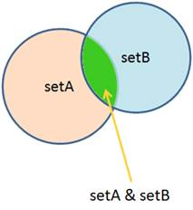
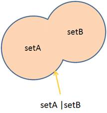
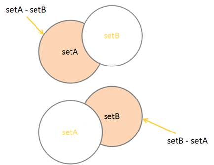
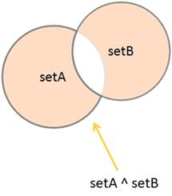

# 6.5. Операции над множествами. Сравнение множеств

Продолжаем изучение множеств языка Python. Сегодня мы будем говорить об операциях над ними.

Это операции:

- пересечение множеств;
- объединение множеств;
- вычитание множеств;
- вычисление симметричной разности.

Рассмотрим подробнее как это всё реализуется непосредственно в языке Python.

## 6.5.1. Пересечение множеств

### 6.5.1.1. Оператор `&`

Перейдём в консоль Python:

```shell
$ python
>>>
```

и здесь определим два множества:

```python
>>> setA = {1, 2, 3, 4}
>>> setB = {3, 4, 5, 6, 7}
```

Как вы видите, некоторые числа в множествах `setA` и `setB` повторяются.

Если произвести такую операцию:

```python
>>> setA & setB
{3, 4}
>>>
```

то получим множество, состоящее из элементов пересеченных множеств `setA` и `setB`, т.е. мы получим элементы общие для этих двух множеств. В данном случае это цифры `3` и `4`.

Итак, мы получаем такой результат:



то что общее для двух множеств `setA` и `setB` как раз и выдаёт эта операция `setA & setB` - пересечение двух множеств.

При этом исходные множества `setA` и `setB` оставляются без изменений:

```python
>>> setA
{1, 2, 3, 4}
>>> setB
{3, 4, 5, 6, 7}
>>>
```

 т.е. оператор `&` возвращает новое множество.

### 6.5.1.2. Оператор `&=`

 Для сохранения этого результата необходимо присвоить его какой-либо переменной:

```python
>>> res = setA & setB
>>> res
{3, 4}
>>>
```

Можно этот результат сохранить в одной из исходных переменных:

```python
setA = setA & setB
>>> setA
{3, 4}
>>>
```

Но чаще это делают таким образом:

```python
setA &= setB
>>> setA
{3, 4}
>>>
```

Здесь результат получается тот же, но запись вида `setA &= setB` более короткая и более читаемая.

Если же нам взять третье множество, например, `setC`:

```python
setC = {9, 10, 11}
```

которое содержит элементы отличные от `setA`, то соответственно на выходе получим пустое множество:

```python
>>> setA & setC
set()
>>>
```

потому что общих элементов у этих двух множеств нет.

Вернём множество `setA` в исходное состояние:

```python
>>> setA = {1, 2, 3, 4}
>>> setA
{1, 2, 3, 4}
>>>
```

### 6.5.1.3. Метод `intersection()`

**Метод `intersection()`** - возвращает множество, содержащий одинаковые элементы в двух или более множествах. **Важно**: возвращенное множество содержит только элементы, существующие в обоих множествах или во всех множествах, если сравнение выполняется более чем с двумя множествами. Вместо этого в качестве сокращения вы можете использовать оператор `&`.

Синтаксис:

```python
set.intersection(set1, set2 ... etc.)
```

Обязательный параметр:

`set1` - Множество для поиска одинаковых элементов.

Необязательный параметр:

`set2` - Другое множество для поиска одинаковых элементов. Вы можете сравнить столько множеств, сколько захотите. Разделяйте множества с помощью `&`.

Операцию пересечения можно записать не только с помощью оператора `&`, но и метода `intersection()`:

```python
>>> setA.intersection(setB)
{3, 4}
>>>
```

На выходе этот метод также возвращает новое множество, которое является пересечением множеств `setA` и `setB`. Т.е. исходные множества остаются по прежнему без изменений:

```python
>>> setA
{1, 2, 3, 4}
>>> setB
{3, 4, 5, 6, 7}
>>>
```

а результат пересечений возвращается в виде нового множества.

### 6.5.1.4. Метод `intersection_update()`

**Метод `intersection_update()`** - удаляет элементы, которых нет в обоих множествах (или во всех множествах, если сравнение выполняется между более чем двумя множествами). Метод `intersection_update()` отличается от метода intersection() тем, что метод intersection() возвращает новое множество без нежелательных элементов, а метод `intersection_update()` удаляет ненужные элементы из исходного набора. Вместо этого вы можете использовать оператор `&=`.

Синтаксис:

```python
set.intersection_update(set1, set2 ... etc)
```

Обязательный параметр:

`set1` - Множество для поиска одинаковых элементов.

Необязательный параметр:

`set2` - Другое множество для поиска одинаковых элементов.
Вы можете сравнить столько множеств, сколько захотите. Разделяйте множества с помощью `&`.

Если мы хочем результат присвоить множеству `setA` то можно использовать метод `intersection_update()`:

```python
setA.intersection_update(setB)
>>> setA
{3, 4}
>>>
```

В итоге у нас множество `setA` изменится и оно будет хранить вот эти два `3` и `4` общих значения.

Т.е. мы можем получать пересечение двух множеств либо с помощью оператора `&`, либо с помощью методов `intersection()` и `intersection_update()`.

Чаще всего на практике используется оператор `&`, потому что это более короткая и наглядная запись.

## 6.5.2. Объединение множеств

### 6.5.2.1. Оператор `|`

А теперь рассмотрим как можно объединять два множества.

Т.е. создавать одно общее множество состоящее из элементов обоих множеств.



Для этого вернём к изначальному состоянию наши множества `setA` и `setB`:

```python
>>> setA = {1, 2, 3, 4}
>>> setB = {3, 4, 5, 6, 7}
>>> setA
{1, 2, 3, 4}
>>> setB
{3, 4, 5, 6, 7}
>>>
```

И далее выполним следующую операцию:

```python
setA | setB
{1, 2, 3, 4, 5, 6, 7}
>>>
```

На выходе мы получим объединение этих двух множеств, множества `setA` и множества `setB`.

По прежнему множество `setA` и множества `setB` остаются неизменными:

```python
>>> setA
{1, 2, 3, 4}
>>> setB
{3, 4, 5, 6, 7}
>>>
```

Т.е. оператор объединения возвращает новое множество, которое является результатом объединения множеств `setA` и `setB`.

### 6.5.2.2. Оператор `|=`

Если же мы хотим результат объединения сохранить в, например, множестве `setA` то это можно сделать так:

```python
setA |= setB
>>> setA
{1, 2, 3, 4, 5, 6, 7}
>>>
```

В этом случае результат объединения будет сохранен в множестве `setA`.

Т.е. оператор "|=" является эквивалентом записи `setA = setA | setB`.

### 6.5.2.3. Метод `union()`

**Метод `union()`** - возвращает множество, содержащее все элементы исходного множества и все элементы из указанного множеств(ва). Вы можете указать любое количество множеств, разделенных запятыми. Это не обязательно должно быть множество, это может быть любой итерируемый объект. Если элемент присутствует более чем в одном множестве, результат будет содержать только один вид этого элемента.

В качестве сокращения вы можете использовать `|`.

Синтаксис:

```python
set | set1 | set2 ...
```

Обязательный параметр:

`set1` - Итерируемый объект для объединения.

Необязательный параметр:

`set2` - Другая итерация для объединения. Вы можете объединить столько итераций, сколько захотите. Разделите каждую итерацию с помощью `|`.

Вернём множество `setA` в исходное состояние:

```python
>>> setA = {1, 2, 3, 4}
>>>
```

И повторим операцию объединения с помощью метода `union()`:

```python
>>> setA.union(setB)
{1, 2, 3, 4, 5, 6, 7}
>>>
```

И на выходе получим объединенное множество.

Т.е. метод `union()` эквивалентен оператору объединения двух множеств - `|`.

Исходные множества и в данном случае не меняются, а на выходе формируется новое множество, ка результат объединения множеств `setA` и `setB`.

## 6.5.3. Вычитание одного множества из другого

Следующая операция, это вычитание одного множества из другого. Причём, здесь важно какое множество из какого вычитается.



Если мы вычитаем из множества `setA` множество `setB` то получим результат как на рисунке выше, он там закрашен.

Т.е. в множестве `setA` остаются только элементы, которые не входят в множество `setB`.

А если мы вычитаем из множества `setB` множество `setA`, то у нас остаётся множество `setB` в которое не включаются общие элементы с множеством `setA`.

Давайте посмотрим как это всё реализуется в Python.

## 6.5.3.1. Оператор `-`

Опять определим изначальные множества `setA` и `setB`:

```python
>>> setA = {1, 2, 3, 4}
>>> setB = {3, 4, 5, 6, 7}
```

и сделаем вот такое вычитание:

```python
>>> setA - setB
{1, 2}
>>>
```

В результате получаем множество, состоящее из двух элементов: `1` и `2`. И действительно, значения `3` и `4` в множестве `setA` совпадают с соответствующими значениями в множестве `setB`. Поэтому, когда мы сделали вычитание, то элементы `3` и `4` были исключены и остались только элементы `1` и `2`.

А если сделать вычитание `setB` из `setA` то получим:

```python
>>> setB - setA
{5, 6, 7}
>>>
```

Т.е. в множестве `setB` остаются только элементы `5`, `6` и `7`, которые не входят в множество `setA`.

### 6.5.3.2. Оператор `-=`

Если же мы хотим результат вычитания сразу присвоить переменной `setA`:

```python
setA -= setB
>>> setA
{1, 2}
>>>
```

то `setA`  у нас соответственно изменится.

## 6.5.4. Симметричная разность

Ну и последняя операция - это симметричная разность.



На выходе мы получаем множество состоящее из элементов уникальных для обоих множеств. Т.е. общие элементы, которые присутствуют и в множестве `setA`, и в множестве `setB` - исключаются, остаются только не совпадающие элементы.

Посмотрим как это работает.

## 6.5.4.1. Оператор `^`

Снова возьмём наши два множества `setA` и `setB`:

```python
>>> setA = {1, 2, 3, 4}
>>> setB = {3, 4, 5, 6, 7}
```

и выполним операцию симметричной разности:

```python
>>> setA ^ setB
{1, 2, 5, 6, 7}
>>>
```

На выходе мы получим множество, из которого общие элементы `3`, `4` были исключены и остались только не совпадающие элементы `1` и `2` из множества `setA` и `5`, `6`, `7` из множества `setB`.

Так производятся основные операции над множествами.

### 6.5.5. Сравнение множеств

В заключении занятия рассмотрим как можно сравнивать множества между собой.

Предположим, что у нас есть два таких множества:

```python
>>> setA = {7, 6, 5, 4, 3}
>>> setB = {3, 4, 5, 6, 7}
>>>
```

Они в принципе равные, только порядок следования элементов у них различается.

Но тем не менее, если мы сравним эти два множества:

```python
>>> setA == setB
True
>>>
```

то получим значение `True`.

Потому что, множества считаются равными, если у них длинна, т.е количество элементов совпадает и значения этих элементов тоже совпадают.

Если мы сделаем сравнение на неравенство:

```python
>>> setA != setB
False
>>>
```

то, соответственно, мы получим значение `False`.

Теперь возьмём два таких множества:

```python
>>> setA = {7, 6, 5, 4, 3}
>>> setB = {3, 4, 5}
>>>
```

которые не равны между собой, причём множество `setA` включает в себя все элементы множества `setB`.

тогда такая операция:

```python
>>> setB < setA
True
>>>
```

вернёт значение `True`.

Потому что множество `setB` действительно включается в множество `setA`.

Соответственно, обратная операция:

```python
>>> setB > setA
False
>>>
```

вернёт - `False`.

Если же в нашем множестве `setB` будет хотя бы один элемент, который отсутствует в `setA`:

```python
>>> setB.add(22)
>>>
```

то такие операции:

```python
>>> setB < setA
False
>>> setB > setA
False
>>>
```

будут давать значение `False`, потому что не одно из множеств не входит в другое.

Если оба множества равны, то операции:

```python
>>> setA = {7, 6, 5, 4, 3}
>>> setB = {3, 4, 5, 6, 7}
>>> setA < setB
False
>>> setA > setB
False
>>>
```

будут выдавать - `False`, потому что если оба множества равны, то ни одно из них не входит в другое.

Но операция:

```python
>>> setA <= setB
True
>>> setA >= setB
True
>>>
```

будут возвращать `True`, потому что сработает как раз равенство `=`, ведь множества в данном случае равны.

На этих примерах, я думаю понятно, как выполняется сравнение множеств между собой.

**Полезные ссылки:**

Урок в прозе: [https://proproprogs.ru/python_base/python3-operacii-nad-mnozhestvami-sravnenie-mnozhestv](https://proproprogs.ru/python_base/python3-operacii-nad-mnozhestvami-sravnenie-mnozhestv "Операции над множествами, сравнение множеств")

Телеграм-канал: [https://t.me/python_selfedu](https://t.me/python_selfedu "Телеграм канал")

Официальный сайт Python: [https://www.python.org](https://www.python.org "Официальный сайт Python")

PEP 8: [https://www.python.org/dev/peps/pep-0008/](https://www.python.org/dev/peps/pep-0008/ "PEP 8")
