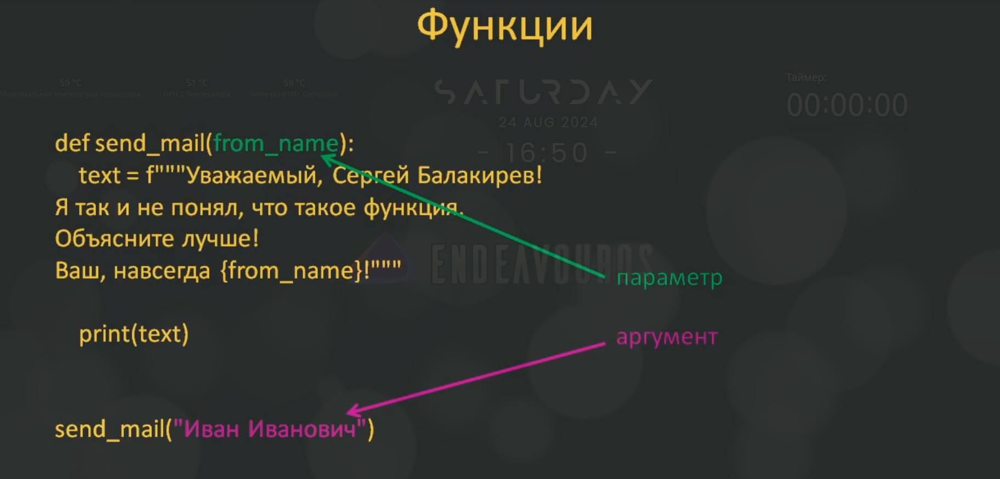

# 7.1. Что такое функции. Их объявление и вызов

## 7.1.1. Понятие функции

Этим занятием мы открываем одну из ключевых тем в программировании - функции.

Что это такое?

**Функция** - активный объект, который не просто хранит какие-либо данные, а выполняет заданный фрагмент программы.

**Имя функции** - это ссылка на этот объект.

Например знакомая нам функция `print()` выполняет вывод в консоль переданных ей данных.

Имя этой функции можно воспринимать как ссылку на объект функцию. И действительно если мы вызовем `print`:

```python
>>> print
<built-in function print>
>>>
```

то увидим, что это ссылка встроенной функции `print`.

А чтобы активизировать эту функцию, необходимо не просто записать `print`, а записать с это с круглыми скобками - `print()`. Тогда запустится программа, которая реализована в этой функции. В данном случае она просто выведет пустую строку:

```python
>>> print()

>>>
```

Круглые скобки в названии функции являются оператором вызова функции. Т.ео. имя функции без круглых скобок `print` - это ссылка на функцию, а с круглыми скобками `print()` - это вызов функции, т.е. программы реализованной внутри этой функции.

Вот этот момент надо очень хорошо себе представлять.

Но если `print` - это ссылка на объект функцию, то кто нам мешает создать ещё одну ссылку на этот объект? Например, с именем `f`:

```python
f = print
>>>
```

Тогда у нас будет две переменные `print` и `f`, которые ссылаются на один и тот же объект функцию. Проверим, будет ли  это работать:

```python
>>> print()

>>> f()

>>>
```

Да, действительно у нас всё сработало, никаких ошибок не было и была выведена пустая строка.

Или давайте выведем сообщение `hello`:

```python
>>> f('hello')
hello
>>>
```

Т.е. теперь мы можем вызывать функцию `print()` через вторую переменную `f()`.

Мало того, переменной `print` мы можем присвоить любое другое значение, например:

```python
>>> print = "это была функция print"
>>>
```

Как видите после выполнения этой команды никаких ошибок не было.

Т.е. теперь переменная `print` ссылается не на функцию `print()`, а на строку `это была функция print`:

```python
>>> print
'это была функция print'
>>>
```

И мы можем вывести эту строку вот таким образом:

```python
>>> f(print)
это была функция print
>>>
```

Т.е. имя функции - это просто ссылка на объект функцию и не более того.

Конечно заменять имена стандартных функций, без особой необходимости, не стоит. А лучше вообще это никогда не делать.

Теперь мы знаем, что такое функция, но зачем они нужны, разве нельзя писать код и без них?

Конечно можно и самые первые языки программирования их даже не имели. Но писать программы с функциями можно гораздо быстрее и удобнее, с функциями они становятся более модульными, а процесс программирования значительно упрощается.

Так за счёт чего это происходит?

Допустим, мы с вами пишем программу, в которой постоянно нужно делать отправку электронных писем по одному и тому же алгоритму. В результате у нас в программе будут появляться одни и те же строчки кода, которые отвечают за отправку электронного письма. Такое дублирование программного кода негативно влияет на надёжность программы, возможность её быстрого редактирования, читаемости и т.д.

В программировании это называются кратко - **DRY (Don't Repeat Yourself)**.

Как только вы замечаете в программе подобное дублирование кода, вы должны понимать, что вы делаете, что-то неверно. И архитектуру и стратегию программы следует пересмотреть. Это очень грубая ошибка в программировании.

Так вот, чтобы нам устранить дублирование кода при отправке электронных писем повторяющийся фрагмент кода нужно поместить в функцию, а затем её вызывать в нужных местах программы.

Это первое для чего были введены функции в программировании - устранять подобное дублирование кода.

Конечно в Python существует множество стандартных встроенных функций, но на все случаи жизни их не придумаешь. Поэтому программист может сам создавать свои собственные функции по мере необходимости.

Для этого используется следующий синтаксис - прописывается ключевое слово `def` затем имя функции и в круглых скобках указывается список аргументов функции, если он нужен, далее после двоеточия идёт блок кода (тело функции), т.е. набор операторов, которые будут выполняться при активизации (выполнение) функции:

```python
def <имя функции>([список аргументов]):
        оператор 1
        оператор 2
        …
        оператор N
```

Имя функции в программах определяется, как правило, через глагол, например: `go`, `show`, `get`, `set` и т.д. Потому что функция что-то делает, а раз что-то делает то, он должна звучать как глагол, как действие.

Давайте в качестве примера зададим простую функцию, которая будет имитировать отправку электронных писем (файл 07.01.01.py):

```python
def send_mail() -> None:
    """Функция имитирующая отправку электронных писем."""
    text = "Уважаемый, Сергей Балакирев! Я так \
и не понял, что такое функция. Объясните лучше!"

    print(text)
```

Мы с вами определили функцию `send_mail()`.

Обратите внимание имя функции выражает действие. Кроме того два слова в имени разделены символом подчеркивания - `_`, что улучшает читаемость кода. И глядя на это название программисту сразу понятно, что должна делать эта функция. Это рекомендуемый подход к именованию называть переменные и функции понятными именами.

Тело функции здесь состоит из двух команд присвоения значения переменной `text` и функции `print()`, которая выводит значение переменной `text` в консоль.

Записывается тело цикла абсолютно так же как в условиях или циклах.

Итак, мы с вами определили функцию, но если сейчас запустить программу, то ничего в консоли не увидим, т.е. функция не сработала. Но так и должно быть, потому что на данном этапе мы функцию лишь определили (объявили), но ещё не вызвали.

Как вы узнали раньше для вызова этой функции необходимо записать имя этой функции и поставить две круглые скобки (файл 07.01.02.py):

```python
def send_mail() -> None:
    """Функция имитирующая отправку электронных писем."""
    text = "Уважаемый, Сергей Балакирев! \
Я так и не понял, что такое функция. Объясните лучше!"
    print(text)


send_mail()
```

Теперь если мы запустим программу, то мы увидим в консоли следующее сообщение:

```python
Уважаемый, Сергей Балакирев! Я так и не понял, что такое функция. Объясните лучше!
```

Т.е. функция была выполнена и результат работы кода функции мы, как раз, и увидели в консоли.

И обратите внимание, как записан вызов функции, между функцией и её вызовом две пустые строки. Так рекомендуется делать по стандарту PEP-8. Т.е. объявление функции и дальнейший текст программы должны разделяться двумя пустыми строками.

Итак мы с вами узнали как объявлять функцию и как её вызывать. Причём вызвать одну функцию в тексте программы мы можем несколько раз (файл 07.01.03.py):

```python
def send_mail():
    """Функция имитирующая отправку электронных писем."""
    text = "Уважаемый, Сергей Балакирев! \
Я так и не понял, что такое функция. Объясните лучше!"
    print(text)


send_mail()
send_mail()
```

Запустив эту программу, мы увидим, соответственно, два вызова функции:

```python
Уважаемый, Сергей Балакирев! Я так и не понял, что такое функция. Объясните лучше!
Уважаемый, Сергей Балакирев! Я так и не понял, что такое функция. Объясните лучше!
```

Т.е. мы можем вызывать функцию столько раз сколько это необходимо. И там где это необходимо - в любом месте текста программы.

Конечно прежде чем вызывать ту или иную функциюЮ мы должны её объявить. Вызов функции должен идти после того как мы её объявили.

Если же мы вызовем функцию до её объявления (файл 07.01.04.py):

```python
send_mail()


def send_mail():
    """Функция имитирующая отправку электронных писем."""
    text = "Уважаемый, Сергей Балакирев! \
Я так и не понял, что такое функция. Объясните лучше!"
    print(text)


send_mail()
```

то, конечно, получим ошибку:

```python
Traceback (most recent call last):
  File "/home/user/Projects/GitHub/Development-Learning/Learn_Python/learn-python-selfedu/listing/07-funktsii/07.01.04.py", line 1, in <module>
    send_mail()
    ^^^^^^^^^
NameError: name 'send_mail' is not defined
```

Поэтому всегда, когда мы используем функцию, мы должны сначала её объявить и только лишь потом вызвать.

## 7.1.2. Как работает функция?

Теперь вернёмся к файлу `07.01.03.py` и посмотрим как будет работать эта программа непосредственно в отладке. Чтобы вы чётко поняли как это всё работает в деталях.

Поставим точку останова на строке первого вызова нашей функции и запустим программу в режиме отладки.

Программа остановилась на строке с точкой останова. Далее, необходимо на плавающей панели отладчика нажать `Шаг с заходом` либо горячую клавишу `F11`. После чего мы попадаем непосредственно в функцию, потому что она была вызвана у нас на точке останова и выполняются две строчки записанные в теле функции.

Снова нажмём клавишу `F11`, чтобы последовательно выполнялись первую команду и вторую. И в результате у нас в консоли напечатается:

```python
Уважаемый, Сергей Балакирев! Я так и не понял, что такое функция. Объясните лучше!
```

Далее нажимаем `Шаг с обходом (F10)`, в результате чего переходим к следующему вызову функции. Теперь нажмём `F11`, чтобы войти в функцию и мы снова переходим в тело функции `send_mail()`. Опять нажимаем `F11` выполняется первая команда, ещё `F11` выполняется вторая команда. И в консоли мы теперь видим два сообщения:

```python
Уважаемый, Сергей Балакирев! Я так и не понял, что такое функция. Объясните лучше!
Уважаемый, Сергей Балакирев! Я так и не понял, что такое функция. Объясните лучше!
```

Нажимаем ещё раз `F10` и программа завершается.

Т.е., в таком порядке происходит вызов функций.

## 7.1.3. Параметры функции

Сейчас, на данный момент, у нашей функции нет никаких параметров, в объявлении функции стоят пустые круглые скобки. Давайте добавим сюда один параметр с именем отправителя, назовём его `from_name`. Как видите, `text` у нас сформирован при помощи f-строки и с именем отправителя. И после того, как у функции появился один параметр, мы должны её вызывать с одним параметром. Если же функцию вызвать без аргумента (файл `07.01.05.py`):

```python
def send_mail(from_name):
    """Функция имитирующая отправку электронных писем."""
    text = f"""Уважаемый, Сергей Балакирев!
    Я так и не понял, что такое функция.
    Объясните лучше!
    Ваш, навсегда {from_name}!"""

    print(text)


send_mail()
```

и в таком виде запустить программу, то мы получим следующую ошибку:

```shell
Traceback (most recent call last):
  File "/home/user/Projects/GitHub/Development-Learning/Learn_Python/learn-python-selfedu/listing/07-funktsii/07.01.05.py", line 17, in <module>
    send_mail()
TypeError: send_mail() missing 1 required positional argument: 'from_name'
```

Ошибка как раз из-за того, что мы вызываем функцию без аргумента, тогда как мы в определении функции указали, что у функции обязательно есть один параметр `from_name` и его нужно указать в вызове функции.

Давайте укажем (файл `07.01.06.py`):

```python
def send_mail(from_name):
    """Функция имитирующая отправку электронных писем."""
    text = f"""Уважаемый, Сергей Балакирев!
    Я так и не понял, что такое функция.
    Объясните лучше!
    Ваш, навсегда {from_name}!"""

    print(text)


send_mail("Иван Иванович")
```

Запустим эту программу и теперь всё сработало:

```python
Уважаемый, Сергей Балакирев!
    Я так и не понял, что такое функция.
    Объясните лучше!
    Ваш, навсегда Иван Иванович!
```

Мы видим наше сообщение с переданным аргументом `"Иван Иванович"`

И давайте подробнее разберём как работает эта конструкция.



Во-первых, обратите внимание на терминологию.

Определение внутри функции называется **параметром функции**, а передаваемое значение при вызове функции - **аргументом функции**. В дальнейшем мы будем использовать эти слова именно в этом смайле.

Далее, когда мы вызываем функцию с одним аргументом, то параметр `from_name` будет ссылаться на объект строку, которую мы указали в аргументе при вызове функции - `"Иван Иванович"`. И внутри нашей функции мы можем использовать уже её параметр, т.е. обычную переменную, которую используем при формировании строки, при формировании сообщения.

Давайте посмотрим, как это работает в режиме отладки. Поставим в строке вызова функции точку останова и запустим отладчик. Нажимаем `F11` - зайдём в тело функции. И смотрите параметр нашей функции `from_name` принимает значение `"Иван Иванович"`. Соответственно оно подставляется при формировании строки и отображается в консоли. Ну и затем программа завершается.

именно так происходит передача аргумента параметру функции.

И ещё раз отметим, если у функции есть один параметр, то при вызове функции должен быть обязательно указан один аргумент. Если не будет ни одного аргумента, то возникнет ошибка. Или если мы запишем два аргумента - тоже будет ошибка.

Давайте у этой функции укажем ещё один параметр - возраст и добавим его в формирование строки и укажем второй аргумент при вызове функции (файл `07.01.07.py`):

```python
def send_mail(from_name, old):
    """Функция имитирующая отправку электронных писем."""
    text = f"""Уважаемый, Сергей Балакирев!
    Я так и не понял, что такое функция.
    Объясните лучше!
    Ваш, навсегда {from_name}! И не судите меня строго, мне всего {old} лет!"""

    print(text)


send_mail("Иван Иванович", 7)
```

Запустим эту программу и увидим, что всё сработало:

```python
Уважаемый, Сергей Балакирев!
    Я так и не понял, что такое функция.
    Объясните лучше!
    Ваш, навсегда Иван Иванович! И не судите меня строго, мне всего 7 лет!
```

Т.е., если нам нужно указать несколько параметров функции, то они просто перечисляются через запятую в круглых скобках после имени функции при её объявлении. Их может быть столько, сколько необходимо. Соответственно, аргументы при вызове функции также должны следовать через запятую. Причём на первый аргумент будет ссылаться первый параметр, а на второй аргумент - второй параметр. Т.е., порядок здесь имеет значение. Причём вторым параметром мы можем указать не только число, но и какую-то строку, программа тоже сработает, никаких ошибок не будет, потому что Python использует динамическую типизацию.

Вот так в самом простом случае можно задавать функции определять у них параметры и, соответственно, их вызывать в программе.

**Полезные ссылки:**

Урок в прозе: [https://proproprogs.ru/python_base/python3-funkcii-pervoe-znakomstvo-opredelenie-def-i-ih-vyzov](https://proproprogs.ru/python_base/python3-funkcii-pervoe-znakomstvo-opredelenie-def-i-ih-vyzov "Функции: первое знакомство, определение def и их вызов")

Телеграм-канал: [https://t.me/python_selfedu](https://t.me/python_selfedu "Телеграм канал")

Официальный сайт Python: [https://www.python.org](https://www.python.org "Официальный сайт Python")

PEP 8: [https://www.python.org/dev/peps/pep-0008/](https://www.python.org/dev/peps/pep-0008/ "PEP 8")
