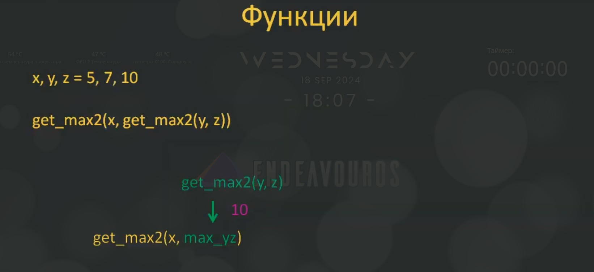

# 7.2. Оператор `return` в функциях. Функциональное программирование

## 7.2.1. Оператор `return` в функциях

Продолжим изучение функций языка Python.

На прошлом занятии мы изучили как можно функции объявлять и вызывать. На этом занятии сделаем следующий шаг и разберемся как функции могут возвращать результаты своей работы.

Возьмём программу, которую мы сделали на прошлом занятии ы функцию `send_mail()` - файл `07.01.07.py` и скопируем его содержимое в новый файл `07.02.01.py`:

```python
def send_mail(from_name, old):
    """Функция имитирующая отправку электронных писем."""
    text = f"""Уважаемый, Сергей Балакирев!
    Я так и не понял, что такое функция.
    Объясните лучше!
    Ваш, навсегда {from_name}! И не судите меня строго, мне всего {old} лет!"""

    print(text)


send_mail("Иван Иванович", 7)
```

И прямо в этом файле (`07.02.01.py`) объявим ещё одну функцию, которая вычисляет квадратный корень из положительных чисел, которая будет принимать один параметр `x`:

```python
def send_mail(from_name, old):
    """Функция имитирующая отправку электронных писем."""
    text = f"""Уважаемый, Сергей Балакирев!
    Я так и не понял, что такое функция.
    Объясните лучше!
    Ваш, навсегда {from_name}! И не судите меня строго, мне всего {old} лет!"""

    print(text)


def get_sqrt(x):
    res = None if x < 0 else x**0.5
```

Обратите внимание, что в соответствии со стандартом PEP8 каждое объявление функции разделяется двумя пустыми строками. Рекомендуется так делать для удобства чтения кода.

Итак, в нашей программе теперь есть новая функция с названием `get_sqrt()`, давайте попробуем её вызвать и посмотрим что она возвратит. Для этого в нашей программе создадим переменную `a` и присвоим ей результат работы функции `get_sqrt()`, которой в качестве аргумента передадим значение `49` и выведем эту значение переменной `a` в консоль:

```python
def send_mail(from_name, old):
    """Функция имитирующая отправку электронных писем."""
    text = f"""Уважаемый, Сергей Балакирев!
    Я так и не понял, что такое функция.
    Объясните лучше!
    Ваш, навсегда {from_name}! И не судите меня строго, мне всего {old} лет!"""

    print(text)


def get_sqrt(x):
    res = None if x < 0 else x**0.5


a = get_sqrt(49)

print(a)
```

Запустим полученную программу:

```shell
None
```

Вы видите мы получили значение `None`, фактически это означает, что функция `get_sqrt()` ничего не возвращает.

Ну почему? Ведь мы сделали необходимые вычисления и переданный аргумент 49 > 0, поэтому переменная `res` не должна быть равна `None`.

Всё дело в том, что внутри функции нужно явно указать, что она должна возвращать. Делается это с помощь специального оператора **`return`**.

В нашем случае мы хотим возвратить переменную `res`. Удалим всё лишнее из программы, чтобы не отвлекаться и вернём результат работы функции при помощи оператора `return` (файл `07.02.02.py`):

```python
def get_sqrt(x):
    res = None if x < 0 else x**0.5
    return res


a = get_sqrt(49)

print(a)
```

Запустим полученную программу:

```shell
7.0
```

И увидим заветный результат `7.0`, ведь корень из 49 = 7.

Более детально эти строчки работают следующим образом.


Вначале вызывается функция `get_sqrt()` с аргументом `49`. Далее с помощью тернарного условного оператора мы вычисляем корень квадратный из 49, т.е. получаем значение `7.0` и это значение присваиваем переменной `res`. Теперь переменная `res` ссылается на объект со значением `7.0` и соответственно оператор `return` возвращает ссылку на этот объект. Т.е. фактически это означает, что сама функция `get_sqrt()` возвращает ссылку на этот числовой объект содержащий значение `7.0`.

И далее когда мы переменную `a` присваиваем числовое значение `7.0`, то у нас в программе создается эта переменная, ну и затем мы её выводим в консоль.

Т.е. то что оператор `return` возвратил, то и возвращает функция `get_sqrt()`.

Поэтому при выполнении программы мы и видим в консоли `7.0`.

Причём переменные, которые находятся внутри функции, в нашем случае переменные `x` и `res`, существуют только внутри этой функции `get_sqrt()`, т.е. внутри тела функции. За пределами функции `get_sqrt()` они не существуют. Например, если мы захотим в нашей программе вывести ещё дополнительно переменную `res` (файл `07.02.03.py`):

```python
def get_sqrt(x):
    res = None if x < 0 else x**0.5
    return res


a = get_sqrt(49)

print(a, res)
```

То у нас в результате работы программы возникнет ошибка:

```shell
Traceback (most recent call last):
  File "/home/scyth1an/Projects/GitHub/Development-Learning/Learn_Python/learn-python-selfedu/listing/07-funktsii/07.02/07.02.03.py", line 24, in <module>
    print(a, res)
             ^^^
NameError: name 'res' is not defined
```

Т.е. интерпретатор языка Python за пределами функции `get_sqrt()` ничего не знает о существовании переменной `res`.

Подробнее об этом мы ещё с вами поговорим. Просто пока имейте ввиду, что за пределами функции вывести напрямую переменную `res`, например, не получится.

Далее, внутри тела функции можно задавать только один оператор `return`. Если мы попытаемся прописать второй оператор `return` (файл `07.02.04.py`):

```python
def get_sqrt(x):
    res = None if x < 0 else x**0.5
    return res
    return x


a = get_sqrt(49)

print(a)
```

Запустим эту программу:

```shell
7.0
```

Мы снова увидели значение `7.0`. Потому что строка со вторым оператором `return` вообще не была выполнена. Т.е. как только внутри функции встречается оператор `return`, функция завершает свою работу.

Давайте в этом убедимся. Для этого перейдём в редакторе VS Code в режим отладки (Ctrl + Shift + D):

1. Поставим точку останова на строке `a = get_sqrt(49)` и посмотрим в деталях как это всё сработает.
2. Запустим отладку нашей программы - нажимаем `F5`.
3. Программа дошла до вызова функции, нажимаем `F11` и заходим внутрь функции `get_sqrt()`.
4. Нажимаем `F11` - выполняется первая строка функции.
5. Ещё нажимаем `F11` - выполняется `return` (вторая строчка) и, как вы видите, мы сразу выходим из этой функции.
6. Нажимаем `F10` и переходим к последней строке нашей программы
7. Снова `F10` - выполняется функция `print(a)`, в консоль выводится `7.0` и программа завершается.

Т.е. как только нам встретился оператор `return`, выполнение кода внутри функции завершается.

Даже если мы вместо `return x` запишем `print(x)` (файл `07.02.05.py`):

```python
def get_sqrt(x):
    res = None if x < 0 else x**0.5
    return res
    print(x)


a = get_sqrt(49)

print(a)
```

и запустим нашу программу то, всё равно, эта строка не сработает и в консоль будет выведен только результат работы `print(a)`:

```shell
7.0
```

А если мы строку `print(x)` расположим выше оператора `return` (файл `07.02.06.py`):

```python
def get_sqrt(x):
    res = None if x < 0 else x**0.5
    print(x)
    return res


a = get_sqrt(49)

print(a)
```

то в консоль будет выведено и значение переменно `x`:

```shell
49
7.0
```

Т.е. в этом случае принт сработал, потому что он идёт до оператора `return`. А как только встретился оператор `return` функция завершила свою работу.

Но всё же что нам делать, если нам необходимо вернуть из функции две переменные, в нашем случае и `res` и `x`?

Это можно сделать с помощью кортежа, например (файл `07.02.07.py`). Тогда мы сможем распаковать наш картеж сразу в две переменные `a` и `b` и соответственно вывести их в консоль:

```python
def get_sqrt(x):
    res = None if x < 0 else x**0.5
    return (res, x)


a, b = get_sqrt(49)

print(a, b)
```

Запустим программу:

```shell
7.0 49
```

Здесь мы как раз видим эти две переменные.

Т.е. вот так при помощи кортежа или любой другой коллекции мы можем вернуть определённые данные, наборы определённых данных.

Кстати, на практике когда используется кортеж, то здесь - `return (res, x)` круглые скобки обычно не ставятся, т.е. записывается так `return res, x`. Т.е. пишется оператор `return` и затем через запятую перечисляются данные, которые мы хотим вернуть.

Видите, как это удобно и просто делается в языке Python, далеко не во всех языках программирования можно так запросто вернуть несколько значений через функцию.

## 7.2.2. Функция как аргумент для другой функции

Давайте зададим в нашей программе функцию для определения максимального значения среди двух чисел и функция будет такой:

```python
def get_max2(a, b):
    return a if a > b else b
```

Казалось бы, что может быть примечательного в такой простой функции, но не торопитесь. Сейчас кое-какая магия откроется перед вами. Вызывать эту функцию можно очевидным образом, например, так:

```python
x, y = 5, 7

print(get_max2(x, y)
```

Здесь специально определены переменные `x` и `y`, чтобы показать, что и так можно передать аргументы в функцию, т.е. не только числовые значения, но и переменные (файл `07.02.08.py`):

```python
def get_max2(a, b):
    return a if a > b else b


x, y = 5, 7

print(get_max2(x, y))
```

Запустим нашу программу:

```shell
7
```

Мы видим значение `7` и действительно это максимальное значение среди `5` и `7`.

Давайте усложним задачу и будем искать максимум среди 3-х чисел `x, y, z = 5, 7, 10`.

Причём максимум мы будем искать при помощи всё той же функции `get_max2()`.

Как это можно сделать? Это делается следующим образом - в качестве второго аргумента мы сделаем вызов ещё одной такой же функции `print(get_max2(x, get_max2(y, z)))` и в качестве аргументов передадим ей два аргумента `у` и `z` (файл `07.02.09.py`):

```python
def get_max2(a, b):
    return a if a > b else b


x, y, z = 5, 7, 10

print(get_max2(x, get_max2(y, z)))
```

И в этом случае сначала мы во внутренней функции `get_max2()` получим максимальное значение из двух переменных `у` и `z` и полученный результат будет сравниваться с переменной `x` во внешней функции `get_max2()`.

Т.е. всё работает именно в таком порядке.



Сначала будет вызываться функция, которая стоит в качестве аргумента, в ней определяется максимум среди значений `7` и `10`, это будет число `10`. Затем число `10` будет подставляться вторым аргументом во внешней функцию `get_max2()` и, соответственно, будет сравниваться с числом `5` и соответственно максимальным значением снова будет `10`.

Запустим нашу программу:

```shell
10
```

И увидим, что действительно всё работает и результат будет именно `10`.

Это и есть обещанная магия. Т.е. мы сделали более сложную задачу используя простую функцию. Мало того мы можем использовать ту же самую конструкцию `get_max2(x, get_max2(y, z))` для объявления новой функции, которая искала бы максимум среди трёх чисел (файл `07.02.10.py`):

```python
def get_max2(a, b):
    return a if a > b else b


def get_max_3(a, b, c):
    return get_max2(a, get_max2(b, c))


x, y, z = 5, 7, 10

print(get_max_3(x, y, z))
```

Запустим программу:

```shell
10
```

Всё работает аналогично.

Т.е., видите, как элегантно можно решить задачу поиска максимального значения среди трёх чисел используя более простую функцию поиска максимума среди двух чисел.

Такой подход называется **функциональный подход** в программировании.

И разумеется, что прежде чем использовать функцию `get_max2()` мы должны ее выше объявить.

## 7.2.3. Объявление функций подобно переменным

Вообще объявление функции в языке Python очень похоже на объявление обычных переменных.

Во-первых, нам никто не мешает объявить переменную `PERIMETER = True` и проделать следующее (файл `07.02.11.py`):

```python
PERIMETER = True
if PERIMETER:
    get_rect = 1
else:
    get_rect = 2

print(get_rect)
```

Но оказывается, всё тоже самое можно делать и на уровне функций (файл `07.02.12.py`):

```python
PERIMETER = True
if PERIMETER:

    def get_rect(a, b):
        return 2 * (a + b)
else:

    def get_rect(a, b):
        return a * b


print(get_rect(1.5, 3.8))
```

Запустим программу:

```shell
10.6
```

В данном случае, у нас переменная `PERIMETER` имеет значение `True` и функция `get_rect()` возвращает значение `10.6`.

А если поменять значение переменной `PERIMETER` на `False` (файл `07.02.13.py`):

```python
PERIMETER = False
if PERIMETER:

    def get_rect(a, b):
        return 2 * (a + b)
else:

    def get_rect(a, b):
        return a * b


print(get_rect(1.5, 3.8))
```

то уже увидим площадь этого прямоугольника:

```shell
5.699999999999999
```

Здорово. Вы видите, какая гибкость в определении функций в языке программирования Python. Такое мало где встретишь.

Ну и наконец, мы можем, вообще, убрать условие и определить эти две функции просто друг за дружкой (файл `07.02.14.py`):

```python
def get_rect(a, b):
    return 2 * (a + b)


def get_rect(a, b):
    return a * b


print(get_rect(1.5, 3.8))
```

Выполним полученную программу:

```shell
5.699999999999999
```

Как видите, никакой ошибки нет. И будет вызвана вторая функция, которая определяет площадь прямоугольника. Т.к. У нас имя функции, это всего лишь ссылка на ее определение и вызов функции вызовет, именно вторую функцию, а первую уберёт сборщик мусора, т.е. она просто перестанет существовать.

Ну и в заключении этого занятия рассмотрим ещё один пример использования функции.

Определим функцию `even(a)`, которая будет определять чётное число или нечётное, т.е. будет выполнять булеву проверку, а далее мы воспользуемся полученным результатом и будем выводить все чётные числа в консоль (файл `07.02.15.py`):

```python
def even(x):
    return x % 2 == 0


for i in range(1, 20):
    if even(i):
        print(i)
```

Запустим эту программу:

```shell
2
4
6
8
10
12
14
16
18
```

И в выводе мы увидим только чётные числа.

Т.е. в цикле функция `even()` при каждой итерации вызывалась, проверялось является ли число чётным и если это так (функция возвращала `True`), то срабатывала функция `print()`.

Как видите, т.о. в цикле мы тоже можем использовать функцию.

Т.е. функцию можно вызывать в любом месте программы, где это необходимо.

На этом мы завершим наше второе занятие по функциям.

Из него вам должно быть понятно:

- как и для чего используется оператор `return`;
- как вызывается функция записанная в аргументах функции;
- а также объявление функций подобно переменным.

**Полезные ссылки:**

Урок в прозе: [https://proproprogs.ru/python_base/python3-operator-return-v-funkciyah-funkcionalnoe-programmirovanie](https://proproprogs.ru/python_base/python3-operator-return-v-funkciyah-funkcionalnoe-programmirovanie "Оператор return в функциях. Функциональное программирование")

Телеграм-канал: [https://t.me/python_selfedu](https://t.me/python_selfedu "Телеграм канал")

Официальный сайт Python: [https://www.python.org](https://www.python.org "Официальный сайт Python")

PEP 8: [https://www.python.org/dev/peps/pep-0008/](https://www.python.org/dev/peps/pep-0008/ "PEP 8")
