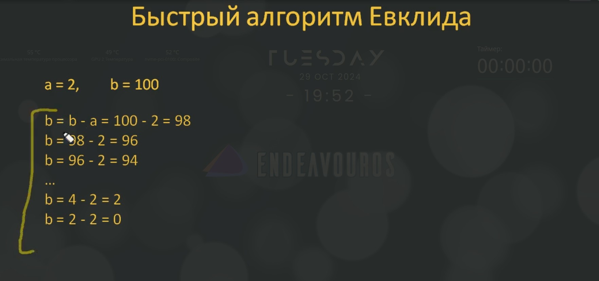
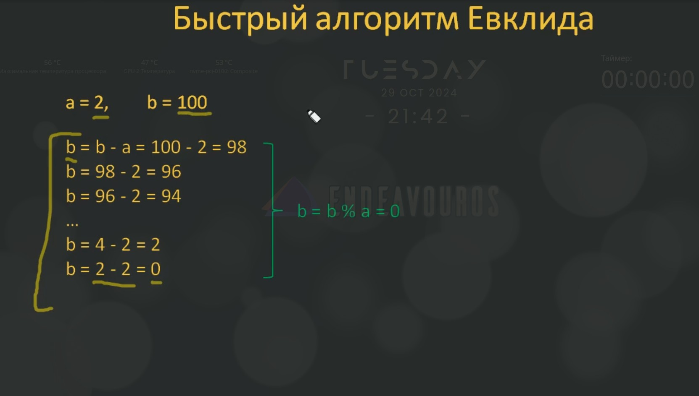
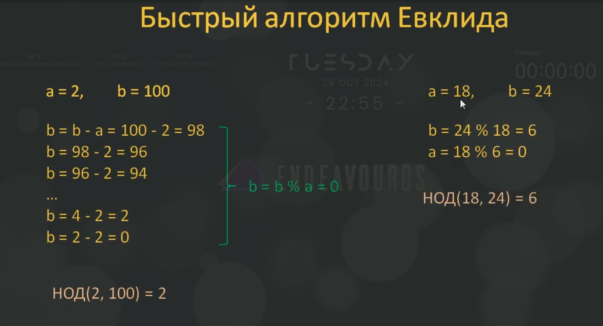

# 07.03. Алгоритм Евклида для нахождения НОД

## 07.03.01. Принцип работы алгоритма Евклида

Продолжим серию занятий по изучению функций языка Python. На этом занятии мы рассмотрим пример использования функций для решения одной частной задачи нахождения наибольшего общего делителя (НОД) с помощью алгоритма Евклида двух натуральных чисел `a` и `b`. Причём, мы не просто напишем алгоритм, т.е. зададим функцию, которая бы это делала, а ещё выполним её тестирование с помощью тестирующих функций.

Т.е. это будет полноценный пример показывающий принцип разработки программ с использованием функций и тестов.

Но, в начале, пара слов о самом алгоритме Евклида, о принципе его работы.

Сначала рассмотрим медленный, но простой вариант использования алгоритма Евклида.

Например, пусть даны два натуральных числа `a = 18` и `b = 24`. Чтобы определить для них НОД, будем действовать следующим образом.

Из большего числа вычтем меньшее:

```math
b - a = 24 - 18 = 6
```

Полученное значение присвоим переменной с большим значением, т.е., фактически, в нашем случае, мы выполняем операцию:

```math
b = b - a
```

На следующей итерации мы получаем таких два значения: `a = 18` и `b = 6`. И снова мы делаем абсолютно тоже, только теперь у нас большее значение хранится в переменной `a`:

```math
a = a - b = 18 - 6 = 12
```

В следующей итерации делаем тоже самое со значениями `a = 12` и `b = 6`:

```math
a = a - b = 12 - 6 = 6
```

Теперь у нас в переменных `a` и `b` находятся одинаковые числа `6`.

И когда числа в переменных стали одинаковыми алгоритм останавливается. Результатом его работы будет:

```math
НОД(18, 24) = 6
```

Весь этот алгоритм можно представить следующим псевдокодом:

```psevdocode
пока a != b
         находим большее среди a и b
         уменьшаем большее на величину меньшего

выводим полученное значение величины a (или b)
```

Вот так работает медленный алгоритм Евклида.

## 07.03.02. Реализации алгоритма Евклида. Функция `help()`. Тестирование функций

### 07.03.02.01. Медленная реализация алгоритма Евклида

А теперь, давайте реализуем этот алгоритм на Python с помощью функции (файл `07.03.01.py`):

```python

def get_nod(a: int, b: int) -> int | None:
    """Вычисляется НОД для 2-х натурвльных чисел по алгоритму Евклида.

    :param a: первое натурвльное число
    :param b: второе натурвльное число
    :return: НОД для 2-х натурвльных чисел
    """  # noqa: RUF002
    while a != b:
        if a > b:
            a -= b
        else:
            b -= a

    return a


res = get_nod(18, 24)
print(res)
```

Запустим этот скрипт и получим:

```bash
6
```

Т.е. для натуральных чисел `18` и `24` мы получили НОД `6`. Что, в принципе, верно.

### 07.03.02.02. Функция `help()`.

Мало того, с помощью специальной функции `help()` мы можем получить описание нашей функции `get_nod()`, для этого мы должны написать `help(get_nod)` (файл 07.03.02.py):

```python
def get_nod(a: int, b: int) -> int | None:
    """Вычисляется НОД для 2-х натурвльных чисел по алгоритму Евклида.

    :param a: первое натуральное число
    :param b: второе натуральное число
    :return: НОД для 2-х натурвльных чисел
    """  # noqa: RUF002
    while a != b:
        if a > b:
            a -= b
        else:
            b -= a

    return a


res = get_nod(18, 24)
print(res)

help(get_nod)
```

Запустив теперь эту программу, мы получим:

```bash
Help on function get_nod in module __main__:

get_nod(a: int, b: int) -> int | None
    Вычисляется НОД для 2-х натурвльных чисел по алгоритму Евклида.

    :param a: первое натуральное число
    :param b: второе натуральное число
    :return: НОД для 2-х натурвльных чисел
```

Вы видите, что функция `help()` выводит описание нашей функции.

Это очень удобно. Если программист не знает что делает функция, то прочитав её описание, он поймёт как её использовать. Именно для этого мы определили многострочный комментарий в начале функции.

### 07.03.02.03. Тестирование функций

После того как мы создали функцию `get_nod()`, нам её нужно протестировать, узнать, а правилно ли она работает? Ведь, может нам лишь повезло и она работает только для этих двух чисел `18` и `24, а для каких-либо других чисел у нас нужного результата не будет. Для того чтобы убедиться в работоспособности нашей функции, нам нужно её протестировать.

Для этого тестировщик создаёт новую вспомогательную функцию `test_get_nod()` и в качестве параметра мы будем передовать нашу функцию `get_nod()` (файл 07.03.03.py):

```python
def get_nod(a: int, b: int) -> int | None:
    """Вычисляется НОД для 2-х натурвльных чисел по алгоритму Евклида.

    :param a: первое натуральное число
    :param b: второе натуральное число
    :return: НОД для 2-х натурвльных чисел
    """  # noqa: RUF002
    while a != b:
        if a > b:
            a -= b
        else:
            b -= a

    return a


res = get_nod(18, 24)
print(res)


def test_get_nod(func: callable) -> str | None:
    """Тестирование функции get_nod.

    Args:
        func (int): тестируемая функция

    Returns:
        str: результат тестирования

    """
    # --- test №1 ---
    a = 28
    b = 35
    c = 7
    res = func(a, b)
    if res == c:
        print("test №1 - OK")
    else:
        print("test №1 - FAIL")


test_get_nod(get_nod
```

Запустив эту программу, мы получим:

```bash
6

test №1 - OK
```

Т.е. результат работы функции `get_nod()` для чисел `18` и `24` - это `6` и результат тестирования функции `test_get_nod()` - `test №1 - OK`. Что означает - первый тест прошел успешно.

Но этого не достаточно.

Давайте напишем ещё один тест, который будет делать следующее (файл 07.03.04.py):

````python
def get_nod(a: int, b: int) -> int | None:
    """Вычисляется НОД для 2-х натурвльных чисел по алгоритму Евклида.

    :param a: первое натуральное число
    :param b: второе натуральное число
    :return: НОД для 2-х натурвльных чисел
    """  # noqa: RUF002
    while a != b:
        if a > b:
            a -= b
        else:
            b -= a

    return a


res = get_nod(18, 24)
print(res)


def test_get_nod(func: callable) -> str | None:
    """Тестирование функции get_nod.

    Args:
        func (int): тестируемая функция

    Returns:
        str: результат тестирования

    """
    # --- test №1 ---
    a = 28
    b = 35
    c = 7
    res = func(a, b)
    if res == c:
        print("test №1 - OK")
    else:
        print("test №1 - FAIL")

    # --- test №2 ---
    a = 100
    b = 1
    c = 1
    res = func(a, b)
    if res == c:
        print("test №2 - OK")
    else:
        print("test №2 - FAIL")


test_get_nod(get_nod)
```

И наконец, третий тест (файл 07.03.05.py):

```python
import time


def get_nod(a: int, b: int) -> int | None:
    """Вычисляется НОД для 2-х натурвльных чисел по алгоритму Евклида.

    :param a: первое натуральное число
    :param b: второе натуральное число
    :return: НОД для 2-х натурвльных чисел
    """  # noqa: RUF002
    while a != b:
        if a > b:
            a -= b
        else:
            b -= a

    return a


res = get_nod(18, 24)
print(res)


def test_get_nod(func: callable) -> str | None:
    """Тестирование функции get_nod.

    Args:
        func (int): тестируемая функция

    Returns:
        str: результат тестирования

    """
    # --- test №1 ---
    a = 28
    b = 35
    c = 7
    res = func(a, b)
    if res == c:
        print("test №1 - OK")
    else:
        print("test №1 - FAIL")

    # --- test №2 ---
    a = 100
    b = 1
    c = 1
    res = func(a, b)
    if res == c:
        print("test №2 - OK")
    else:
        print("test №2 - FAIL")

    # --- test №3 ---
    a = 2
    b = 10_000_000
    c = 2
    st = time.time()
    res = func(a, b)
    et = time.time()
    dt = et - st
    if res == c and dt < 1:
        print("test №3 - OK")
    else:
        print("test №3 - FAIL")

    print(f"Время выполнения: {dt}")


test_get_nod(get_nod)
````

Теперь у нас есть три теста:

1. `test #1` - вычисляет наибольший общий делитель для двух натуральных чисел;
2. `test #2` - вычисляет тоже, что и `test #1`, но с другими натуральными числами;
3. `test #3` - вычисляет наибольший общий делитель и время выполнения функции`get_nod()`.

Запустим нашу программу и посмотрим, что мы получим:

```bash
6
test №1 - OK
test №2 - OK
test №3 - OK
Время выполнения: 0.21455812454223633
```

Как видите все три теста прошли успешно и мы можем посмотреть время выполнения функции `get_nod()`.

Но давайте в третьем тесте для переменной `b` добавим больше нулей, укажем большее число - `100_000_000` (файл 07.03.06.py):

```python

import time


def get_nod(a: int, b: int) -> int | None:
    """Вычисляется НОД для 2-х натурвльных чисел по алгоритму Евклида.

    :param a: первое натуральное число
    :param b: второе натуральное число
    :return: НОД для 2-х натурвльных чисел
    """  # noqa: RUF002
    while a != b:
        if a > b:
            a -= b
        else:
            b -= a

    return a


res = get_nod(18, 24)
print(res)


def test_get_nod(func: callable) -> str | None:
    """Тестирование функции get_nod.

    Args:
        func (int): тестируемая функция

    Returns:
        str: результат тестирования

    """
    # --- test №1 ---
    a = 28
    b = 35
    c = 7
    res = func(a, b)
    if res == c:
        print("test №1 - OK")
    else:
        print("test №1 - FAIL")

    # --- test №2 ---
    a = 100
    b = 1
    c = 1
    res = func(a, b)
    if res == c:
        print("test №2 - OK")
    else:
        print("test №2 - FAIL")

    # --- test №3 ---
    a = 2
    b = 100_000_000
    c = 2
    st = time.time()
    res = func(a, b)
    et = time.time()
    dt = et - st
    if res == c and dt < 1:
        print("test №3 - OK")
    else:
        print("test №3 - FAIL")

    print(f"Время выполнения: {dt}")


test_get_nod(get_nod)
```

Запускаем:

```bash
6
test №1 - OK
test №2 - OK
test №3 - FAIL
Время выполнения: 2.0215795040130615
```

Мы видим, что третий тест провалился, потому что время выполнения превышает 1 секунду. Что нам и говорит, что наша функция реализует медленный алгоритм Евклида.

Т.е. благодвря тому, что мы записали тестирующую функцию мы теперь более-менее уверены, что функция `get_nod()` работает, но работает медленно.

И давайте посмотрим как можно ускорить этот алгоритм, т.е. реализовать быстрый алгоритм Евклида.

### 07.03.02.04. Быстрая реализация алгоритма Евклида

Делается это на самом деле очень просто.

Предположим, что у нас есть два натуральных числа `a = 2` и `b = 100`. По медленному алгоритму ысё работает так:



Мы постоянно из переменной `b` вычитали `2` до тех пор пока не получили `b = 2 - 2 = 0`.

В свою очередь серия таких вычитаний, фактически, есть не что иное как вычисление остатка от деления `b = b % a = 0`. Т.е. мы смотрим сколько раз двойка входит в эти `100`:



Эти вычитания по сути это и делают, но зачем нам делат вычитания, когда сожно просто взять остаток от деления и определить конечный результат? Причём сразу и быстро.

Эта идея положена в основу быстрого алгоритма Евклида. И в соответствии с этим алгоритмом мы делаем следующее. Допустим, есть два наитуральных числа `a = 18` и `b = 24`:



Сначала мы вычисляем остаток от деления `b = b % a = 24 % 18 = 6`. Затем опять для большего вычисляем остаток от деления на меньшее - `a = a % b = 18 % 6 = 0`. И как только остаток от деления станет равен нулю, то меньшее значение, в нашем случае `6` и есть наибольший общий делитель. Видите, как легко и просто это можно реализовать.

Псевдокод этого быстрого алгоритма Евклида можно записать так:

```pseudocode
пока меньшее число больше 0
    большему числу присваиваем остаток от деления на меньшее число
выводим большее число
```

Давайте реализуем этот алгоритм непосредственно на python:

```python
import time


def get_nod(a: int, b: int) -> int | None:
    """Вычисляется НОД для 2-х натурвльных чисел по быстрому алгоритму Евклида.

    :param a: первое натуральное число
    :param b: второе натуральное число
    :return: НОД для 2-х натурвльных чисел
    """  # noqa: RUF002
    if a < b:
        a, b = b, a

    while b != 0:
        a, b = b, a % b

    return a


res = get_nod(18, 24)
print(res)


def test_get_nod(func: callable) -> str | None:
    """Тестирование функции get_nod.

    Args:
        func (int): тестируемая функция

    Returns:
        str: результат тестирования

    """
    # --- test №1 ---
    a = 28
    b = 35
    c = 7
    res = func(a, b)
    if res == c:
        print("test №1 - OK")
    else:
        print("test №1 - FAIL")

    # --- test №2 ---
    a = 100
    b = 1
    c = 1
    res = func(a, b)
    if res == c:
        print("test №2 - OK")
    else:
        print("test №2 - FAIL")

    # --- test №3 ---
    a = 2
    b = 100_000_000
    c = 2
    st = time.time()
    res = func(a, b)
    et = time.time()
    dt = et - st
    if res == c and dt < 1:
        print("test №3 - OK")
    else:
        print("test №3 - FAIL")

    print(f"Время выполнения: {dt}")


test_get_nod(get_nod)
```

Запустим наш скрипт:

```bash
6
test №1 - OK
test №2 - OK
test №3 - OK
Время выполнения: 9.5367431640625e-07
```

Как видите, теперь все тесты прошли успешно и время выполнения значительно сократилось.

Надеюсь, что после этого занятия вы поняли общий принцип разработки и тестирования ключевых программных функций, а также принцип работы алгоритма Евклида.

**Полезные ссылки:**

Урок в прозе: https://proproprogs.ru/python_base/python3-algoritm-evklida-dlya-nahozhdeniya-nod

Телеграм-канал: https://t.me/python_selfedu

Официальный сайт Python: https://www.python.org

PEP 8: https://www.python.org/dev/peps/pep-0008/

Полезные ссылки

Урок в прозе: [https://proproprogs.ru/python_base/python3-algoritm-evklida-dlya-nahozhdeniya-nod
](https://proproprogs.ru/python_base/python3-algoritm-evklida-dlya-nahozhdeniya-nod "Алгоритм Евклида для нахождения НОД")

Телеграм-канал: [https://t.me/python_selfedu](https://t.me/python_selfedu "Телеграм канал")

Официальный сайт Python: [https://www.python.org](https://www.python.org "Официальный сайт Python")

PEP 8: [https://www.python.org/dev/peps/pep-0008/](https://www.python.org/dev/peps/pep-0008/ "PEP 8")
